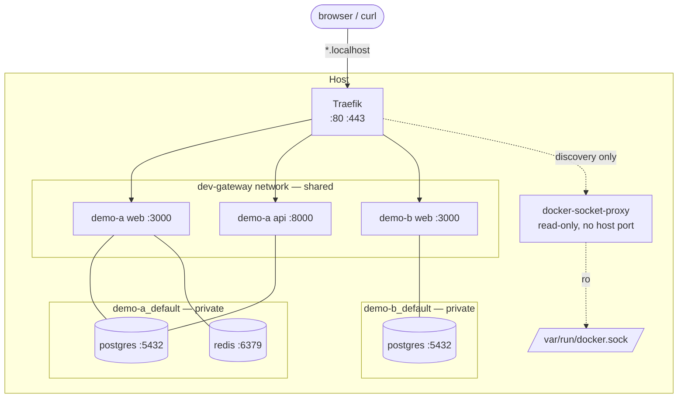

# Dev Gateway

Run every project you work on at the same time, on the same machine, without
ever renumbering a port or killing somebody else's containers.

```
$ dev-gateway urls
PROJECT                      SERVICE        URL
base-empresarial             api            http://base-empresarial-api.localhost
base-empresarial             web            http://base-empresarial-web.localhost
base-empresarial-issue59     api            http://base-empresarial-issue59-api.localhost
base-empresarial-issue59     web            http://base-empresarial-issue59-web.localhost
issue-flow                   web            http://issue-flow-web.localhost
```

All of those run `web` on internal port 3000 and `api` on 8000. Each has its
own Postgres on 5432 and Redis on 6379. None of them publishes a host port.

---

## The problem

A host port can only be held by one process. So the moment two projects both
want `3000:3000` — or you check out a second worktree of the same project — you
have to pick one:

- stop the other environment, which interrupts whoever was using it;
- renumber ports inside the project, so development stops resembling production;
- keep a spreadsheet of who owns which port.

None of those scale past a couple of projects, and all of them get worse when
several agents work in parallel.

## The idea

Container ports and host ports are different things. Two containers can both
listen on 3000 forever; the conflict only exists because something publishes
that port on the host.

So publish nothing. One shared router holds 80 and 443, every project attaches
its HTTP services to one shared Docker network, and each service gets a
hostname derived from the name its Compose project already has. Databases and
caches stay on the project's own private network and are reached, when a human
actually needs them, through a temporary loopback bridge.

## What it is not

The Dev Gateway is host infrastructure, installed once. It is **not** a parent
Compose project.

It does not move your projects, clone them, mount their directories, own their
volumes or databases, or take part in their lifecycle. It never stops a
container it did not create, never removes a volume it does not own, and never
runs `docker system prune`. Your projects stay exactly where they are, in their
own repositories, started and stopped from their own directories.

See [ADR 0001](docs/adr/0001-decoupled-infrastructure.md).

## Architecture



Traefik only ever reaches services on the shared network. It has no route to
any project's private network, and never needs one.

## Requirements

**macOS** — [OrbStack](https://orbstack.dev) (recommended) or Docker Desktop,
Git, and a shell. **Linux** — Docker Engine 24+, the Compose v2 plugin, Git,
and a shell.

Nothing else is required on the host. `jq`, `socat`, database clients and other
tooling run in containers the gateway manages.

## Quick start

```bash
git clone git@github.com:fabioassuncao/dev-gateway.git
cd dev-gateway
cp .env.example .env

./bin/dev-gateway bootstrap
./bin/dev-gateway up local
./bin/dev-gateway doctor
```

Then try the bundled examples — two unrelated stacks that both use ports 3000
and 8000 internally:

```bash
make demo-up
```

```
http://demo-a-web.localhost
http://demo-a-api.localhost
http://demo-b-web.localhost
http://demo-b-api.localhost
```

Add `./bin` to your `PATH`, or symlink `bin/dev-gateway` somewhere on it, to
drop the `./bin/` prefix.

## Adopting a project

Your project stays where it is. You add one file to it:

```yaml
# compose.dev-gateway.yaml — the entire integration
services:
  web:
    networks: [default, dev-gateway]
    labels:
      - "traefik.enable=true"
      - "traefik.docker.network=dev-gateway"
      - "traefik.http.services.${COMPOSE_PROJECT_NAME}-web.loadbalancer.server.port=3000"

networks:
  dev-gateway:
    external: true
    name: dev-gateway
```

```bash
docker compose -f compose.yaml -f compose.dev-gateway.yaml up -d
```

Start with `dev-gateway analyze /path/to/project`, which reads the project and
reports what it would take. It never writes anything.

Full walkthrough: **[docs/adopting-projects.md](docs/adopting-projects.md)**.

## Working in parallel

`COMPOSE_PROJECT_NAME` is the namespace. Change it and you get a completely
independent environment — its own containers, network, volumes and hostnames:

```bash
COMPOSE_PROJECT_NAME=base-empresarial-issue59 \
  docker compose -f compose.yaml -f compose.dev-gateway.yaml up -d
# -> http://base-empresarial-issue59-web.localhost
```

The first environment keeps running. Nothing inside the project changed.

## Databases, Redis and other TCP services

They are never published on the host and never joined to the shared network.
When a human needs one — TablePlus, `psql`, `redis-cli` — the gateway opens a
temporary bridge on a free loopback port:

```bash
dev-gateway access open --project base-empresarial --service postgres
# -> 127.0.0.1:55431
```

Full details land with the TCP access tooling (`docs/tcp-access.md`).

## Commands

| | |
|---|---|
| `dev-gateway bootstrap` | Prepare the host: runtime checks, shared network, state |
| `dev-gateway up [profile]` | Start the gateway |
| `dev-gateway down` | Stop it — applications keep running |
| `dev-gateway status` | Compact overview |
| `dev-gateway doctor` | Deep diagnostics with suggested fixes |
| `dev-gateway urls` | Hostnames currently being served |
| `dev-gateway inspect` | Resolved configuration and compose files |
| `dev-gateway update` | Pull pinned images and recreate |

`--json` is available on `status`, `doctor` and `urls`. `make` targets mirror
these for convenience; Make is never required.

## Security

Short version: nothing is exposed unless you ask for it.

- Traefik never sees the Docker socket. A read-only, endpoint-filtered proxy on
  an `internal` network does discovery ([ADR 0002](docs/adr/0002-docker-socket-proxy.md)).
- `exposedByDefault=false` — a service is routed only when it opts in.
- The local profile binds to `127.0.0.1`.
- The dashboard is off; when enabled it is loopback-only and never routed
  through the public entrypoints.
- Databases, caches and the Docker API are never published publicly, and
  `doctor` fails if they are.

Details: **[docs/security.md](docs/security.md)**.

## Documentation

| | |
|---|---|
| [architecture.md](docs/architecture.md) | How the pieces fit together |
| [networking.md](docs/networking.md) | Networks, ports, and what talks to what |
| [configuration.md](docs/configuration.md) | Every setting in `.env` |
| [local-development.md](docs/local-development.md) | macOS and Linux workstations |
| [remote-development.md](docs/remote-development.md) | Running on a VPS |
| [tailscale.md](docs/tailscale.md) | VPN-only access |
| [dns-and-tls.md](docs/dns-and-tls.md) | Wildcard DNS and certificates |
| [public-access.md](docs/public-access.md) | Opting in to internet exposure |
| [cloudflare.md](docs/cloudflare.md) | Optional DNS automation |
| [firewall.md](docs/firewall.md) | Minimal rules, and why Docker bypasses UFW |
| [remote-bootstrap.md](docs/remote-bootstrap.md) | Preparing a host over SSH |
| [adopting-projects.md](docs/adopting-projects.md) | Adapting a project, with a checklist |
| [monorepos.md](docs/monorepos.md) | Monorepos and worktrees |
| [agent-guidelines.md](docs/agent-guidelines.md) | Rules for autonomous agents |
| [templates/](templates/) | Overlay templates for the usual project shapes |
| [security.md](docs/security.md) | Threat model and hardening |
| [troubleshooting.md](docs/troubleshooting.md) | When something does not route |
| [adr/](docs/adr/) | Why things are the way they are |

## Status

Experimental (`v0.x`). The local profile is exercised by the end-to-end suite
on every change. See [CHANGELOG.md](CHANGELOG.md) for what is tested and what
is not.

## License

MIT — see [LICENSE](LICENSE).
