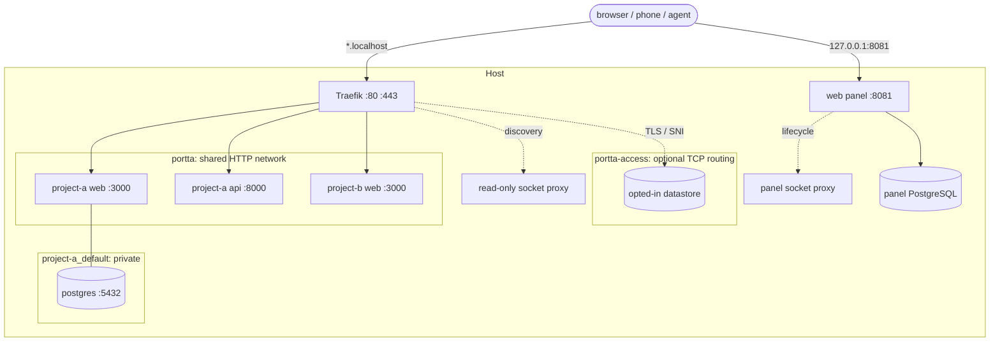

# Portta

A personal, experimental gateway for running many Docker projects at once — locally, on a VPS or in a homelab — each on a predictable URL instead of a port to remember.

```text
$ portta urls
PROJECT                      SERVICE        URL
base-empresarial             api            http://base-empresarial-api.localhost
base-empresarial             web            http://base-empresarial-web.localhost
base-empresarial-issue59     api            http://base-empresarial-issue59-api.localhost
base-empresarial-issue59     web            http://base-empresarial-issue59-web.localhost
issue-flow                   web            http://issue-flow-web.localhost
```

All of those can use the same internal ports. None needs to publish one on the host.

## Why

I keep several side projects, experiments and prototypes alive at once. An idea may be written down today and picked up whenever there is time.

The work is not always on one machine: there is a laptop, a development VPS, a homelab, and increasingly agents such as Claude Code and Codex doing work while I am elsewhere. I still want to see what is running from a browser or phone.

Everything runs in containers on purpose. Dependencies stay isolated, the host stays clean, and a stack can be started or discarded without becoming part of the machine.

That creates a different set of problems: port conflicts, ports nobody remembers, remote access, testing on a phone, and occasionally sharing one URL with someone else. Portta is the arrangement I use to solve those for my own workflow; it is public because there is no reason for it not to be.

## What it does

A host port can only be held by one process, but many containers can listen on the same internal port. Portta therefore publishes almost nothing. One Traefik instance holds 80 and 443, HTTP services join one shared Docker network, and each gets a hostname derived from its Compose project and service names.

Databases and caches stay on each project's private network. A temporary loopback bridge, or optional TLS/SNI routing on a private entrypoint, reaches them when a human needs to. The optional panel shows projects, routes and problems, manages the permitted container lifecycle, and persists only durable decisions and identity in its private PostgreSQL.

This is host infrastructure installed once, not a parent Compose project. It does not move projects, own their volumes, or participate in their lifecycle. See [ADR 0001](docs/adr/0001-decoupled-infrastructure.md).

## Screenshots

<table>
  <tr>
    <td width="50%"><a href=".github/images/panel-overview.png"></a><br><sub><b>Overview</b> — what is running and what is wrong</sub></td>
    <td width="50%"><a href=".github/images/panel-projects.png"></a><br><sub><b>Projects</b> — Compose projects, databases included</sub></td>
  </tr>
  <tr>
    <td width="50%"><a href=".github/images/panel-services.png"></a><br><sub><b>Services</b> — every routed and private service</sub></td>
    <td width="50%"><a href=".github/images/panel-docker.png"></a><br><sub><b>Docker</b> — the whole host, ownership made explicit</sub></td>
  </tr>
  <tr>
    <td width="50%"><a href=".github/images/panel-access.png"></a><br><sub><b>Access</b> — databases without published ports</sub></td>
    <td width="50%"><a href=".github/images/panel-overview-dark.png"></a><br><sub><b>Dark theme</b> — the same live overview</sub></td>
  </tr>
</table>

The panel is optional and loopback-only by default. Run `portta web up`, then open <http://127.0.0.1:8081>. The complete walkthrough and all ten images are in [the panel documentation](docs/web-ui.md).

## How it works

This is the `local` profile with the optional panel enabled:



Traefik reaches HTTP services only on the shared network; it has no route into a project's private network. `remote-private` adds the Tailscale sidecar and `remote-public` deliberately binds the public interface. The exact networks, profiles and persistence boundary are in [Architecture](docs/architecture.md).

## Requirements

**Required on the host:** Docker Engine 24+ with Compose v2 and a POSIX shell. Node is not required for the core commands (`bootstrap`, `up`, `down`, `restart`, `status`, `logs`, `urls`, `inspect`, `update`, `doctor`, `tls`, `remote`, `toolbox`); the full CLI needs Node 22.12+. Git is needed only to develop Portta or to collect project metadata.

**Run by the gateway:** Traefik, filtered Docker socket proxies, `jq`, `socat`, OpenSSL, database clients, access bridges, and the panel's Node runtime.

**Only for developing Portta:** Node 22+, ShellCheck, and Playwright's browser dependencies.

| Verified environment | Evidence |
|---|---|
| macOS 15+ arm64 with OrbStack | Full suite run during development |
| Ubuntu 24.04 amd64 with Docker Engine | Full suite in CI |

Other platforms may work but are not claimed as verified. See the complete [compatibility matrix](docs/compatibility.md).

## Quick start

On a VPS or a workstation, one command installs it and the same command updates
it. It pulls published images, keeps everything under one directory, and asks
only what it cannot detect:

```bash
curl -fsSL https://raw.githubusercontent.com/fabioassuncao/portta/main/install.sh | bash
```

No clone, no build, and no Node on the host. It asks where to keep its data,
how you want to reach the panel (public behind authentication, over Tailscale,
or localhost only), and nothing else. Applications stay unexposed either way.
See [installing and updating](docs/install.md).

To work on Portta itself, take the checkout instead:

```bash
git clone git@github.com:fabioassuncao/portta.git
cd portta
cp .env.example .env

./bin/portta bootstrap
./bin/portta up local
./bin/portta doctor
```

Then start the bundled demo stacks, which deliberately reuse internal ports:

```bash
make demo-up
```

Among their routes are `demo-a-web.localhost`, `demo-a-api.localhost`, `demo-b-web.localhost`, and `demo-b-api.localhost`. Add `./bin` to `PATH` to drop the prefix.

## Adopting a project

The project stays in its own repository. Add an overlay that joins only its HTTP service to the shared network and opts it into Traefik:

```yaml
services:
  web:
    networks: [default, portta]
    labels:
      - "traefik.enable=true"
      - "traefik.docker.network=portta"
      - "traefik.http.services.${COMPOSE_PROJECT_NAME}-web.loadbalancer.server.port=3000"
networks:
  portta: { external: true, name: portta }
```

`portta analyze /path/to/project` reports the required changes without writing; `portta init /path/to/project` can generate the overlay. Follow the [adoption checklist](docs/adopting-projects.md).

## Documentation

The categorised documentation index, command reference, ADRs and project templates live in **[docs/README.md](docs/README.md)**.

## Security

Nothing is exposed by default. Datastores stay private, Docker access is filtered, public and VPN modes require explicit configuration, and destructive operations are constrained by ownership. Read the [threat model and hardening details](docs/security.md).

## Status

Experimental (`v0.x`), personal, and without a support promise. The local profile, panel, persistence, parallel environments and TCP access are exercised end to end. Remote profiles render and are checked for unsafe binds, but the tailnet and ACME paths require real credentials and are not automated.

Cross-host synchronisation and task orchestration are future work, not current features. The TypeScript package and its binary are both named `portta`. More mature tools exist; use one of them if this particular set of trade-offs is not useful to you. Issues, pull requests and forks are welcome.

See [compatibility](docs/compatibility.md) and the [changelog](CHANGELOG.md).

## License

MIT. See [LICENSE](LICENSE).
