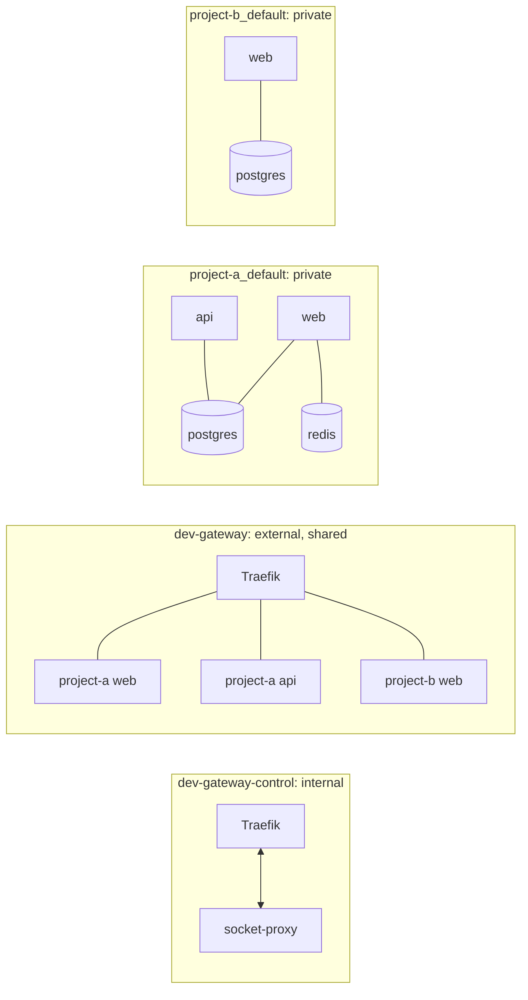

# Architecture

## The one idea

A container port and a host port are different things. Ten containers can all
listen on 3000 forever. The conflict only appears when something publishes
3000 *on the host*.

So the gateway publishes almost nothing. One router holds 80 and 443 for the
whole machine, and everything else is reached by hostname over a shared Docker
network.

## Components

| Component | Image | Role |
|---|---|---|
| Traefik | `traefik:v3.7.12` | The only process holding 80/443. Routes by hostname. |
| Docker socket proxy | `tecnativa/docker-socket-proxy:v0.5.0` | Read-only, filtered Docker API for discovery. |
| `bin/dev-gateway` | — | The operational contract: bootstrap, up/down, doctor, urls, access. |
| Web panel | `dev-gateway-web:local` | Optional. Read-mostly administration UI on loopback. |
| Panel socket proxy | `tecnativa/docker-socket-proxy:v0.5.0` | Optional. The panel's own filtered Docker API. |

That is the whole permanent footprint: two small containers, or four with the
panel enabled. Bridges and toolbox containers are created on demand and removed
when done.

## Networks



**`dev-gateway`** is external, created by `bootstrap`, and shared by every
project.
Its lifecycle is independent of both the gateway stack and the projects: it
survives `dev-gateway down` and is never removed automatically.

**`dev-gateway-control`** is created with `internal: true`, so it has no route
off the host. Only Traefik and the socket proxy are on it. This is what keeps
the Docker API away from anything that handles network traffic.

**`dev-gateway-web`** exists only when the panel is enabled. It is also
`internal: true`, and carries nothing but the panel and its own socket proxy.
The two proxies are separate because their permission sets are:
Traefik's is read-only, the panel's adds the container lifecycle
([ADR 0008](adr/0008-web-panel-socket-proxy.md)).

**`<project>_default`** is each project's own network, created by its own
Compose file. Postgres, Redis, queues and search live here and nowhere else.
Traefik has no route to these networks and never needs one.

A service that should be reachable through the gateway joins **both** its
private network and the shared one. Nothing else changes about it.

## How a request is routed

1. `demo-a-web.localhost` resolves to `127.0.0.1` (see
   [local-development.md](local-development.md)).
2. Traefik, holding `127.0.0.1:80`, matches the `Host` header.
3. The matching router points at a service Traefik built from the container's
   labels, and dials the container **over the `dev-gateway` network**, pinned
   by `providers.docker.network` so a multi-homed container is never reached
   through a private network.
4. The application answers on its own internal port. Nothing was published.

## How a service is discovered

Traefik's Docker provider watches the event stream through the socket proxy.
`exposedByDefault=false` means a container is ignored unless it sets
`traefik.enable=true`.

For an opted-in container with no explicit rule, the hostname comes from
`providers.docker.defaultRule`, a template over the labels Compose already
injects ([ADR 0005](adr/0005-hostname-convention.md)):

```
<com.docker.compose.project>-<com.docker.compose.service>.<domain>
```

So a project never writes its own name into a routing rule, and a new worktree
gets new hostnames by changing one environment variable.

## Lifecycle independence

This matters enough to be a design constraint rather than a nice property:

- `dev-gateway down` stops **two containers**. Every application keeps running.
- `dev-gateway up` rediscovers whatever is already running.
- `dev-gateway restart` does not restart a single application container.
- Tearing down a project leaves the gateway healthy and the shared network intact.

`tests/e2e/lifecycle.test.sh` asserts all of it.

## Ownership

Everything the gateway creates carries:

```
dev-gateway.managed=true
dev-gateway.component=<traefik|socket-proxy|shared-network|access-bridge|...>
```

Every path that stops or removes anything checks that label first. There is no
code path that can remove a consumer container, network or volume.

## Profiles

| Profile | Reachable from | TLS |
|---|---|---|
| `local` | loopback | off by default |
| `remote-private` | the tailnet only | optional |
| `remote-public` | the internet, opt-in | ACME wildcard |

Profiles are Compose overlays that add only the keys they change, over a shared
`compose.yaml` ([ADR 0003](adr/0003-traefik-static-config-via-env.md)).

## What the gateway deliberately cannot do

It cannot start, stop or reconfigure your applications; it cannot repair a
misconfigured project. It can only observe and report, which is why `doctor`
and `analyze` are as thorough as they are.
