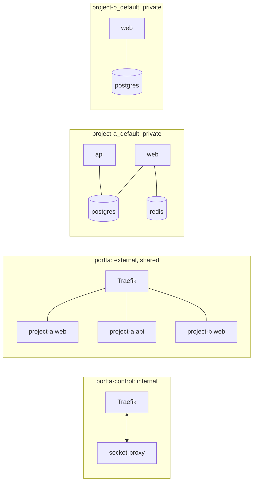

# Portta architecture

## The one idea

A container port and a host port are different things. Ten containers can all
listen on 3000 forever. The conflict only appears when something publishes
3000 *on the host*.

So the gateway publishes almost nothing. One router holds 80 and 443 for the
whole machine, and everything else is reached by hostname over a shared Docker
network.

## Components

| Component | Image | Role |
|---|---|---|
| Traefik | `traefik:v3.7.12` | The only process holding 80/443. Routes by hostname. |
| Docker socket proxy | `tecnativa/docker-socket-proxy:v0.5.0` | Read-only, filtered Docker API for discovery. |
| Portta auth | `fabioassuncao/portta:<VERSION>` | ForwardAuth for *project* hostnames and shares: a branded login and host-scoped sessions; no published port. Not the panel's login. |
| `bin/portta` | — | The operational contract: bootstrap, up/down, doctor, urls, access. |
| Web panel | `fabioassuncao/portta:<VERSION>` | Optional. One Node process: Next pages, the Hono API, the event stream and the WebSocket upgrades, on one port. |
| Panel socket proxy | `tecnativa/docker-socket-proxy:v0.5.0` | With the panel. The panel's own filtered Docker API. |
| Panel PostgreSQL | `postgres:18.6-alpine` | With the panel, and required by it: accounts, decisions and identity, never runtime observations. |

The enabled Compose features determine the permanent footprint. Bridges and toolbox containers are created on demand and removed
when done.

### The panel is one process

Pages, API, events and WebSockets all answer on one port, from one Node
process: a session cookie has one origin, and a panel split across two ports
would need a proxy in front of it to have one. A small HTTP server dispatches
`/api/*` to Hono, `/ws/*` to the authorised upgrade handler and everything else
to Next's App Router — see
[ADR 0036](../../development/adr/0036-next-app-router-and-the-custom-server.md).

It signs people in itself. `PORTTA_AUTH_MODE=disabled` answers everybody as the
local operator and is only allowed on loopback; `required` gives it accounts,
roles, sessions, `ptt_` tokens and an optional second factor, all in its own
database ([ADR 0035](../../development/adr/0035-authentication-lives-in-the-panel.md),
[ADR 0038](../../development/adr/0038-roles-and-project-access.md),
[ADR 0039](../../development/adr/0039-personal-api-tokens.md)). PostgreSQL is a boot dependency
rather than a feature: the panel refuses to start without it
([ADR 0037](../../development/adr/0037-drizzle-and-a-required-database.md)).

For implementation boundaries and command development, see [Monorepo layout](../../development/monorepo.md).

## Networks



**`portta`** is external, created by `bootstrap`, and shared by every
project.
Its lifecycle is independent of both the gateway stack and the projects: it
survives `portta down` and is never removed automatically.

**`portta-control`** is created with `internal: true`, so it has no route
off the host. Only Traefik and the socket proxy are on it. This is what keeps
the Docker API away from anything that handles network traffic.

**`portta-web`** exists only when the panel is enabled. It is also
`internal: true`, and carries nothing but the panel and its own socket proxy.
The two proxies are separate because their permission sets are:
Traefik's is read-only, the panel's adds the container lifecycle
([ADR 0008](../../development/adr/0008-web-panel-socket-proxy.md)).

**`portta-data`** also exists only with the panel. It is `internal: true`
and carries only the panel and PostgreSQL. The database has no published port,
never joins `portta`, and keeps data in a named volume. It persists typed
preferences and stable identity while Docker, Git and Traefik remain the live
sources of runtime observations. See [Panel persistence](persistence.md).

**`<project>_default`** is each project's own network, created by its own
Compose file. Postgres, Redis, queues and search live here and nowhere else.
Traefik has no route to these networks and never needs one.

A service that should be reachable through the gateway joins **both** its
private network and the shared one. Nothing else changes about it.

## How a request is routed

1. `demo-a-web.localhost` resolves to `127.0.0.1` (see
   [Develop applications locally](../guides/local-development.md)).
2. Traefik, holding `127.0.0.1:80`, matches the `Host` header.
3. The matching router points at a service Traefik built from the container's
   labels, and dials the container **over the `portta` network**, pinned
   by `providers.docker.network` so a multi-homed container is never reached
   through a private network.
4. The application answers on its own internal port. Nothing was published.

## How a service is discovered

Traefik's Docker provider watches the event stream through the socket proxy.
`exposedByDefault=false` means a container is ignored unless it sets
`traefik.enable=true`.

For an opted-in container with no explicit rule, the hostname comes from
`providers.docker.defaultRule`, a template over the labels Compose already
injects ([ADR 0005](../../development/adr/0005-hostname-convention.md)):

```text
<com.docker.compose.project>-<com.docker.compose.service>.<domain>
```

So a project never writes its own name into a routing rule, and a new worktree
gets new hostnames by changing one environment variable.

## Lifecycle independence

This matters enough to be a design constraint rather than a nice property:

- `portta down` stops **two containers**. Every application keeps running.
- `portta up` rediscovers whatever is already running.
- `portta restart` does not restart a single application container.
- Tearing down a project leaves the gateway healthy and the shared network intact.

`tests/e2e/lifecycle.test.sh` asserts all of it.

The panel may still **operate** a project on request, without owning it
([ADR 0030](../../development/adr/0030-the-panel-and-a-project-lifecycle.md)): start, stop and
restart by iterating the containers it can already see, and rebuild or take a
project down through one opt-in runner (`PORTTA_RUNNER=true`) whose command is
fixed at creation. `portta down` still stops only the gateway.

## Ownership

Everything the gateway creates carries:

```text
portta.managed=true
portta.component=<traefik|socket-proxy|shared-network|access-bridge|...>
```

Every path that stops or removes anything checks that label first. There is no
code path that can remove a consumer container, network or volume.

## Profiles

| Profile | Reachable from | TLS |
|---|---|---|
| `local` | loopback | off by default |
| `remote-private` | the tailnet only | optional |
| `remote-public` | the internet, opt-in | ACME wildcard |

Profiles are Compose overlays that add only the keys they change, over a shared
`docker/compose/compose.yaml` ([ADR 0003](../../development/adr/0003-traefik-static-config-via-env.md)).

## What the gateway deliberately cannot do

It does not own a project's containers, volumes or release cycle. On request
it may start, stop or restart what it can see, in Compose dependency order,
and it may ask Compose to rebuild or take a project down through the opt-in
runner ([ADR 0030](../../development/adr/0030-the-panel-and-a-project-lifecycle.md)). Rebuild
preserves volumes. Removal is two named modes — keep data, or include local
data — and the Compose project name is typed back, on the server. Nothing
on GitHub is touched. It cannot repair a misconfigured project. `doctor`
and `analyze` still only observe.
