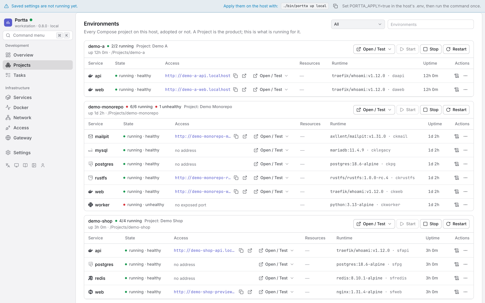
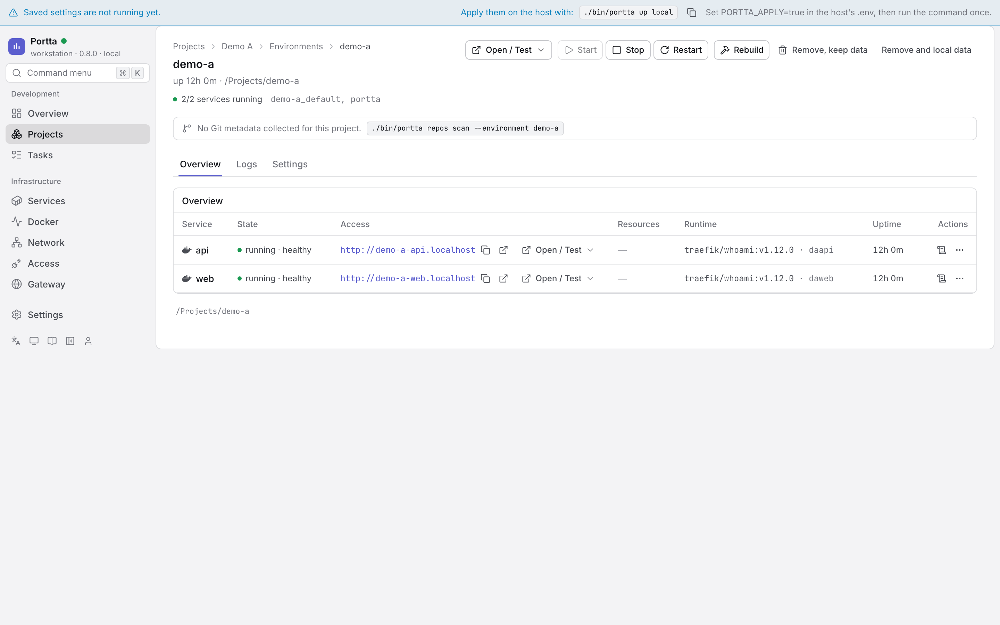

# Manage environments

## Environments

`/environments` lists them; `/environments/<name>` is one, with `logs` and
`settings` as routes beside it. The rail shows Docker, Network and Gateway only
to somebody who holds `docker:read` or `gateway:read` — a navigation entry that
would answer 404 is a worse answer than no entry. Starting, stopping and
restarting need `environment:operate`; rebuilding, removing and forgetting need
`environment:destroy`; the overrides form needs `environment:settings`. Reading
logs is `logs:read`, which a viewer has: they can watch what is happening and
change none of it.



`/environments` lists every Compose project on this host, adopted or not,
each as a table of its services. `/environments/<name>` is one environment:



The header says how many services run, which Project adopted it and why,
which repository and branch it runs from, and the task it is working on when
the panel can tell; then **Open / Test**, Start, Stop, Restart, Rebuild and
the two named removals. Three tabs:

| Tab | What it holds |
|---|---|
| **Overview** | One row per service: state and health, the primary address with copy and open, **Open / Test**, CPU and memory from the host collector, image and container, uptime, and the actions that apply. A row opens a drawer with every endpoint, the connection details of a datastore, ports, networks, mounts, what Traefik says, the temporary share, the hostname alias, and the logs inline |
| **Logs** | Every service at once, interleaved, or one of them; see [Logs across an environment](#logs-across-an-environment) |
| **Settings** | Display name, description, primary service, collapsed services, pinned and archived, service notes and the hostname alias — nothing is written inside the project |

**Open / Test** is the one menu that answers "how do I reach this": every
address by scope — local, LAN, VPN, public — with open and copy, and for a
datastore the loopback bridge to open or close, the host, the port and a
connection string. It is the same model the Access page manages
([ADR 0024](../../development/adr/0024-capabilities-providers-endpoints.md)).

An old `/environments/<name>/services` opens the overview; `/…/git` opens
the repository the environment runs from.

### Remembered environments

An environment whose containers were all removed does not vanish: the panel
remembers where it ran (`working_dir`, the Compose files) and lists it as
**remembered**, with no services. On a Project page it stays under its
Project. Two things can happen to it: **Start**, which asks the runner for
`docker compose up` with the remembered paths when `PORTTA_RUNNER=true`, or
answers with the exact command to run on the host when it is not; and
**Forget**, which drops the row with its overrides and links, and touches
nothing on the host. A live environment cannot be forgotten: stop and remove
it first. Removing an environment (with or without its volumes) leaves it
remembered, since its directory is still there; only removing the directory
forgets it in the same step. `GET /api/environments?all=true` returns both kinds, each with
`presence: live` or `presence: remembered`.

### Logs across an environment

The Logs tab reads **every** service of the environment at once, interleaved by
the timestamp Docker already puts on each line, with the service name in front:

```text
web      | 10:00:01  listening on 3000
api      | 10:00:02  GET /health 200
postgres | 10:00:03  ready to accept connections
```

A selector narrows the view to one service, and the choice is in the URL
(`/environments/alpha/logs?service=api`), so a link opens on exactly what you were
reading. Tail size, the text filter, follow, timestamps and copy are the same
controls the service drawer has, because it is the same component; copying an
aggregated view prefixes each line with its service.

Services are read concurrently on the server, and a source that could not be
read is reported **beside** the ones that answered rather than replacing them: a
stopped container is marked with its state, an unreadable one carries the
reason, and four working services stay on screen. An unknown environment is a
404; a known one whose sources all failed is a 200 that says why.

The aggregated default is 100 lines per service (200 when reading one), clamped
to 2000 overall, so a ten-service environment cannot ask for twenty thousand
lines. If a container logs through a driver that omits timestamps, the view
says ordering between services is approximate rather than pretending otherwise.

**Out of scope, deliberately:** streaming over SSE or WebSocket, retention,
indexing, structured-log parsing, level filtering and download-as-file. This is
a bounded tail on a three-second poll, and it is meant to stay one.

### Naming an environment without touching it

A cloned third-party repository arrives as `awesome-thing-svc-1` on
`awesome-thing-svc-1.localhost`, with five services listed flat. The
environment's **Settings** tab adjusts all of that from the panel, and writes
nothing inside the project — no file, no label, no dependency, no commit.
`git status` in the clone stays clean after using every control here.

| Override | Effect |
|---|---|
| Display name | The heading and the sort key. The derived name is still shown beside it |
| Description | A line under the heading |
| Primary service | The service the environment's Open / Test targets first |
| Collapsed services | Folded away by default, never removed |
| Pinned / archived | Ordering and default filtering in the list |
| Service note | A line on the service row |
| **Hostname alias** | **An additional hostname, routed by Traefik** |

Everything except the alias is presentation, kept in the gateway's own
database. **Nothing is ever only-renamed**: the derived name and the derived
hostname stay on screen next to the override, so a hostname that behaves oddly
can still be traced back to the label that produced it.

Overrides key on `COMPOSE_PROJECT_NAME`, so `storefront` and
`storefront-issue59` are two environments with two sets of overrides, and a new
worktree starts blank. That is deliberate: two worktrees must never contend for
one hostname.

With PostgreSQL stopped, every environment renders exactly as it does without
any persistence at all, and the override endpoints answer `503` with a hint.
The feature disappears; nothing else notices.

### A hostname alias is a nickname, not a rename

```text
alpha-web.localhost      derived, still answering
shop.localhost           alias, answering too
```

Setting an alias writes one router into `portta-aliases.yaml`, the third
and last file the panel may write in Traefik's dynamic directory
([ADR 0011](../../development/adr/0011-panel-reads-traefik-writes-one-file.md)). Traefik
hot-reloads it: no container is recreated and the gateway is not restarted.

**Both hostnames answer.** The panel cannot rewrite a label on a running
container, and would not restart someone's environment to change a nickname, so
an alias can only ever be additional. The UI shows both, everywhere.

Aliasing **refuses** rather than warns, and every refusal happens before
anything is written:

- a hostname a running container already derives or declares;
- a hostname another alias already took;
- a hostname outside `PORTTA_DOMAIN`, `PRIVATE_DOMAIN` or `PUBLIC_DOMAIN`
  — the gateway will not mint an address it cannot serve;
- a service whose `kind` is not `http`: a database is reached through
  [Configure TCP routing](tcp-routing.md), not by an HTTP router;
- a service off the shared network, or one that never enabled Traefik;
- a service with no unambiguous HTTP port. The project's own
  `traefik.http.services.*.loadbalancer.server.port` label is used when present
  and a single exposed port otherwise; anything else is refused rather than
  guessed, because a guessed port produces a router that silently 502s.

The database row and the generated file are written as one operation, and a
failed file write rolls the row back, so the panel and Traefik cannot disagree
about what answers.

The CLI reads the same file, so the two tools never contradict each other:

```bash
portta urls          # aliases are listed and marked as such
portta doctor        # flags an alias whose target container is gone
```

Anything the panel refuses can still be written by hand into
`config/traefik/dynamic/` — that file is yours, and the panel never touches it.

### Sharing it, temporarily

The Exposure section on a service offers three states: **private** (the absence
of a share, and the default), **protected** (an additional hostname behind a
generated password) and **public** (an additional hostname with none, refused
unless public access is already on).

Every share carries an expiry, the password is shown exactly once and stored
only as a hash, and revoking one deletes a block from a generated file. The
project's own router, labels and configuration are never touched.
`portta share list|revoke|gc` manages the same objects from the host. See
[Share a service](sharing.md).

### Why a route behaves like this

Opening a service shows what Traefik itself says about it, next to what its
labels say: the router it built, the rule, the entrypoints, the middlewares, the
backend it resolved, and its status with Traefik's own error text when it
refused one.

```text
Traefik   storefront-web@docker   enabled   websecure     dashboard →
          Host(`storefront-web.dev.example.com`)
          middlewares: portta-secure-headers@file
          → http://172.18.0.7:3000
```

This is the one question labels cannot answer. The panel derives hostnames the
same way Traefik does and is right about them, which is exactly why "the labels
look right and it still 404s" had nowhere to go.

It needs the Traefik API, which means `PORTTA_DASHBOARD=true`, and that is
off by default. When it is off the panel says **the API was not asked** rather
than implying the labels were confirmed, and everything else is unchanged.
`doctor` gains two checks when it is on: a routed service Traefik never built a
router for, and a router Traefik refused, quoted.

The read has its own timeout and its own cache and never runs while a page is
rendering, so a slow or dead Traefik costs nothing but this block. The dashboard
is linked to, never embedded: it is a good tool and duplicating it would need
the insecure-mode API exposed more widely than it already is. See
[ADR 0011](../../development/adr/0011-panel-reads-traefik-writes-one-file.md), and
[Security](../concepts/security.md) for what enabling that API costs.
