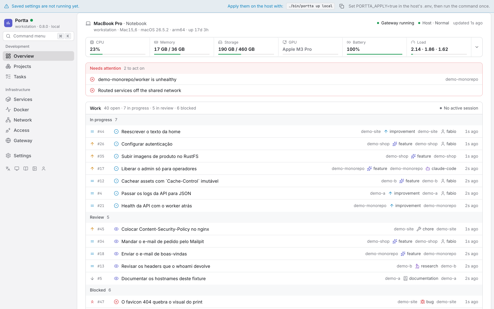
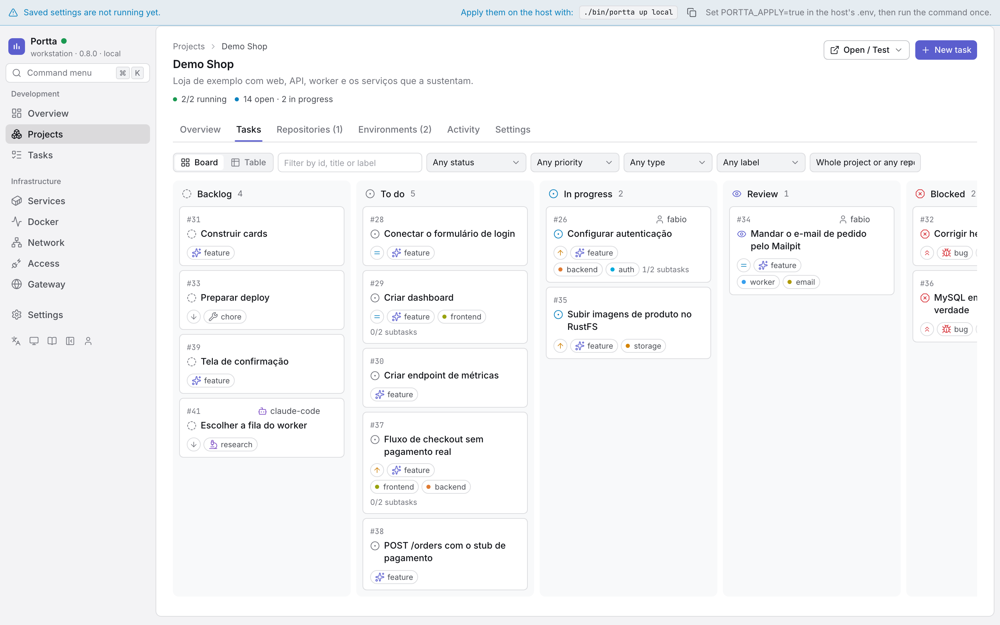
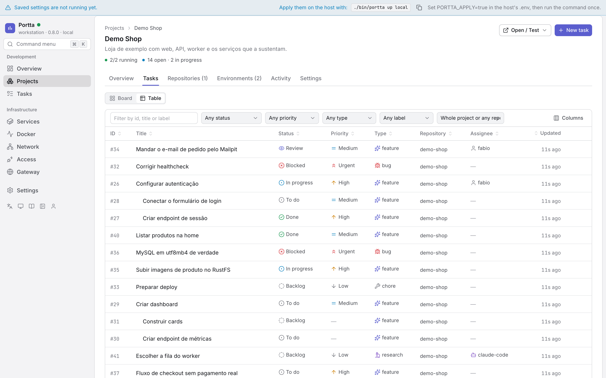
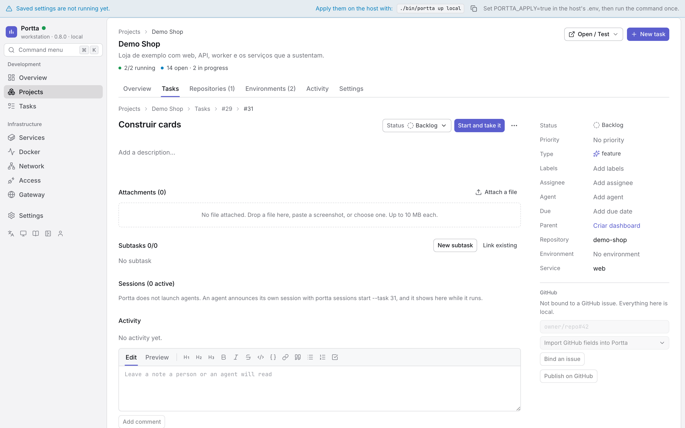
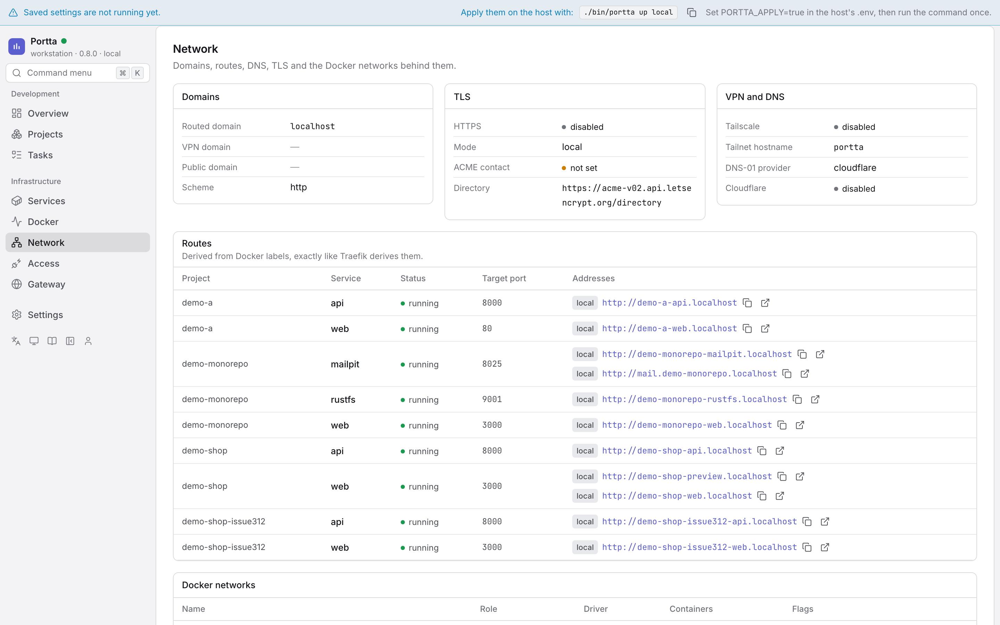
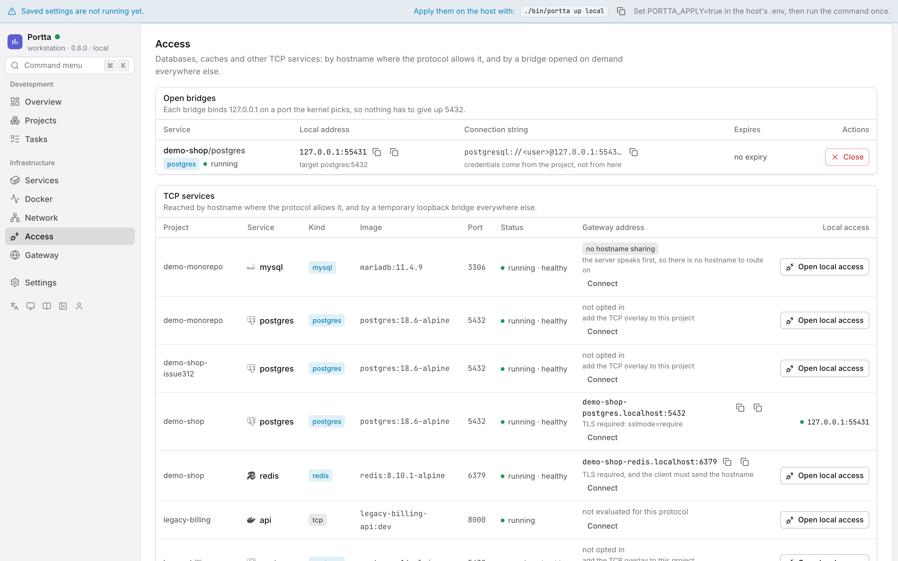
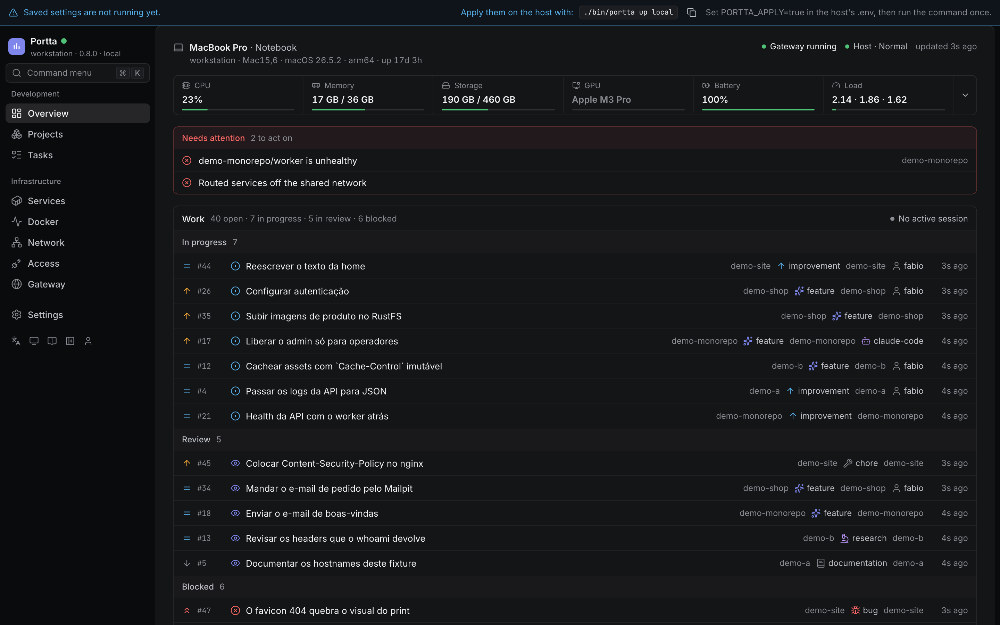

# Use the web panel

The panel is where a development project is opened: what needs doing, who is
on it, which repositories make it up, what changed, which environments are
running, how to reach and test them, what the logs say and how much of the
host they use. It complements the CLI and `portta mcp` rather than replacing
them: all three work on the same API and the same model
([ADR 0032](../../development/adr/0032-portta-development-model.md)). Docker and Traefik remain
the live sources of runtime facts; the panel persists the decisions — Projects,
repositories, tasks, sessions — and a bounded history of what happened
([ADR 0013](../../development/adr/0013-what-the-panel-persists.md)).

It is off by default.

```bash
./bin/portta web up
./bin/portta web open      # http://127.0.0.1:8081
```



Every screenshot on this page comes from the same host, described in
`apps/web/e2e/demo-host.mjs`, seeded with `docker/examples`, and rendered by
the real panel at 1440×900. Regenerate them with `npm run screenshots` (see
[Development](../../development/development-setup.md#development-with-hot-reloading)).

---

## What it is for

The reference scenario is being away from the machine while an agent works on
a project on it. Open the panel: there is a task in progress, the agent that
took it, the repository it is in, the commits it produced, the branch and its
state, the environment running for it. Open the application through the
domain, the VPN or a protected address, test it, read the logs if something
is off, add a note or a subtask, and the agent reads the context again and
carries on. The same flow, with a person instead of an agent, is a normal day.

The second scenario is a host with several projects and several agents on it:
when it starts to run out of room, the Overview says which projects and
environments are using it, and one of them can be stopped from there.

It is not a Docker management tool. There is no image management, no volume
management, no `docker compose` editor, no terminal, no prune, and no way to
create an arbitrary container. See [Out of scope](../../development/panel-architecture.md#out-of-scope).


## Starting it

```bash
./bin/portta web up          # build if needed, then start
./bin/portta web open        # print the URL, and open a browser
./bin/portta web status      # where it listens, and whether it is healthy
./bin/portta web logs        # follow it
./bin/portta web restart
./bin/portta web down        # stop it; the gateway keeps running
./bin/portta web disable     # stop it and take it out of `portta up`
./bin/portta db status       # database health
./bin/portta db migrate      # apply pending SQL without a restart
```

`web up` writes `PORTTA_WEB=true` to `.env`, so from then on
`portta up` brings the panel along with the rest of the gateway.
`web disable` undoes that.

The panel image still builds its own Node runtime. Starting it through the full
CLI requires Node 22.12+ on the host; the core zero-Node fallbacks remain
`bootstrap`, `up`, `down`, `status` and `doctor`.


## Reaching it

### Local

`http://127.0.0.1:8081`, and nothing else. The port is published on
`PORTTA_WEB_BIND_ADDRESS`, which is `127.0.0.1` and should stay that way.

Change the port if 8081 is taken:

```bash
./bin/portta web up --port 8099
```

### Over the VPN

On a VPS, the panel is useful precisely when you are not sitting at the VPS.
The private profile routes it through Traefik, which on that profile listens on
the tailnet and nowhere else:

```bash
./bin/portta config set panel.auth required
./bin/portta web up --expose vpn
# https://portta-web.vpn.example.com
```

This adds a Traefik router for `PORTTA_WEB_HOST.<domain>`. It is refused on the
`remote-public` profile, where that private router would be public, and it is
refused while `PORTTA_AUTH_MODE` is `disabled`: a routed panel can stop and
remove every container on the host, and it would answer anybody who found it.

A routed panel also defaults to read-only. `--writable` opts out, deliberately.

### Signing in

The panel signs people in itself. On a routed panel, `PORTTA_AUTH_MODE=required`
means the first visit lands on `/setup`, which creates the owner — the only
account that is ever created that way. Everybody after that is created by an
administrator, and each of them has a role that decides what they may do.

```bash
# from the host, when there is no browser on it
printf %s "$PASSWORD" | ./bin/portta auth bootstrap \
  --name 'Ada Lovelace' --email ada@example.com --password-stdin
```

The session is a cookie the panel issues and can revoke; banning somebody takes
effect on their next request. A CLI or a coding agent carries a `ptt_` token
instead, which never holds more than its owner's role. Nothing in front of the
panel decides any of this. See [Authentication](authentication.md) and
[ADR 0035](../../development/adr/0035-authentication-lives-in-the-panel.md).

### Public exposure

```bash
./bin/portta web up --expose public
# https://portta-web.dev.example.com
```

Public exposure uses the same Portta login, lockout and host-scoped sessions.
It remains an explicit choice because this panel controls container lifecycle;
prefer a VPN when the audience does not need a public path, and use TLS whenever
the route crosses an untrusted network.

If you are on a plain VPS without a VPN, an SSH tunnel is the answer:

```bash
ssh -N -L 8081:127.0.0.1:8081 deploy@vps
# then open http://127.0.0.1:8081 locally
```

### Read-only mode

```bash
./bin/portta web up --read-only
```

Every mutating endpoint answers `403`. Useful when an agent is driving the
panel and you want it to be able to look but not touch.

---


## Navigation

Use [Projects](projects.md), [Environments](environments.md), [Services](services.md), [Tasks](tasks.md), and [Settings](panel-settings.md) for their operating procedures.

### Overview

The Development Dashboard, in the order the questions come. The first is
whether this machine has room, so it is answered first, in the band at the
top; the rest follow:

- **Work** — the tasks in progress, in review and blocked across every
  project, with the person or agent on each;
- **Sessions** — who is working, on what, since when, with how many commits;
- **Needs attention** — unhealthy services, degraded environments, tasks whose
  local edit conflicts with GitHub, a host under pressure, and what the
  gateway's own diagnostics failed;
- **Projects** — each product at a glance: open and in-progress tasks, active
  sessions, running environments, health, last commit, last activity;
- **Code** — the most recent commits across every repository, and the
  repositories with uncommitted or unpushed work;
- **Using this host** — the environments using the most of it, each with a Stop.

The page has no visible title: its subject is the host, so the host is what
it opens with. One line says what the machine is — its commercial name where
the platform reports one (`MacBook Pro`) or else its hostname, and whether it
is a notebook, a desktop, a server or a virtual machine, from the chassis the
collector read; a machine that reports none of that gets its name and nothing
invented. The line under it holds the facts: the hostname when the commercial
name took its place, the provider or hypervisor of a virtual machine
(`Hetzner`, `QEMU`), the model, the OS and its version, the architecture, and
how long it has been up. Beside them sit the gateway's state, the host's
verdict — **Normal**, **Watch**, **Under pressure** or **Critical**, computed
from every reading together (see `hostPressure` in `packages/core`) — and the
age of the last snapshot. Then every measurement `portta host collect`
reported — CPU, memory, storage, and, where the machine has them, GPU,
temperature, battery and load — is one cell of a strip, with the last thirty
minutes and the details in its tooltip. A host that has no battery grows no
battery cell. The top says who the machine is; the strip says how it is. The
same pressure is said once at each level: the verdict names it, the reading's
colour points at it, and the attention band spells out the readings that
caused it.

The page sizes itself to what there is to say. With nobody working, the
sessions panel is a word in the work panel's corner rather than an empty
card; with nothing to act on, the attention band is one line; with no
commit collected yet, the code section is a heading and the command that
collects one.

The gateway's configuration lives on the Gateway page. Without PostgreSQL the
work and project sections are empty and say so; the runtime, the host and the
diagnostics still answer. It is served by `GET /api/overview`, which
`portta overview` and an agent read too.


### Tasks



A task is Portta's own: it exists without GitHub. `/projects/<slug>/tasks` is
the board — six columns, `Backlog`, `To do`, `In progress`, `Review`,
`Blocked`, `Done` — or the list, nested by parent; the choice and the filters
(status, assignee, repository, text) live in the hash, so a filtered view is
a link somebody can paste. A card moves by dragging or from its menu; the
write happens at once and a refusal rolls it back visibly.



The **Table** view is the same rows as a table rather than as a board: sortable
by any column, with the columns a given host does not care about switched off,
and a status changed from the row without opening the task. Subtasks stay
nested under their parent until a column is sorted on.



A task page, `/projects/<slug>/tasks/<id>`, carries the description, the
subtasks, the notes, the sessions working on it and their commits, the
environments it runs in (linked by the `portta.task` label, the branch name,
the namespace, or by hand) and the GitHub binding: which issue, whether the
last local edit reached GitHub (`synced`, `pending`, `conflict`), and the
actions — bind to an existing issue, publish as a new one, sync, settle a
conflict either way, unbind, comment on the issue. See
[GitHub synchronization](../concepts/github-sync.md#issues-and-tasks).

`portta tasks` and the MCP tools read and write the same rows
([CLI reference](../reference/cli.md), [MCP reference](../reference/mcp.md)).


### Network

Domains (local, VPN, public), TLS mode and ACME contact, Tailscale state, the
DNS provider, every routed hostname with its target port, and the Docker
networks with their role: shared, control, access, or a project's own.




### Access

Databases, caches and anything else that speaks TCP rather than HTTP.

```text
PostgreSQL    base-empresarial/postgres     [ Open local access ]
```

and afterwards:

```text
127.0.0.1:55431      copy host   copy port   copy connection string   close
```

The bridge is the same one [`portta access open`](tcp-access.md) creates,
with byte-identical labels, so `portta access list`, `close` and `gc`
manage it too and neither tool is surprised by the other's work. It binds
`127.0.0.1` on a port the kernel picks, so any number of databases can be
reachable at once without one of them having to give up 5432.

The connection string is a template. It never contains a password: the gateway
does not read a project's `.env` to be helpful.

The **Gateway address** column is the other way in, when
[hostname routing](tcp-routing.md) is enabled: a stable
`<project>-<service>.<domain>:<port>` that needs no bridge at all. Where a
protocol cannot do it the column says so rather than leaving a blank, and where
a project has not opted in it says that too.



This page also lists persistent forwarders created with
[`portta service publish --private`](tailscale-services.md).


### Live updates

Two channels, and they carry different things.

**The event stream** (`GET /api/events`, server-sent events) is what keeps the
pages current: a container changed state, a task moved, a repository was
scanned. It needs `activity:read`, and every event is filtered against the
principal it belongs to — an event about a Project somebody does not reach is
not delivered late or redacted, it is not delivered. Events with no Project in
them at all (a settings change, a gateway restart) go only to the people who
see everything. The browser reconnects on its own; the panel sends a keepalive
every twenty seconds so a proxy does not close a quiet stream.

**The log stream** (`/ws/environments/:name/logs`) is a WebSocket, because
following a log is a stream and polling for it was three requests for the same
lines every three seconds. Pressing **Follow** opens one connection and the
lines arrive as Docker emits them. It reconnects with a widening delay, says so
while it is trying, and falls back to the polling it replaced when it cannot
stay up.

The handshake is authorised before it becomes a socket: `logs:read`, scoped to
whichever Project adopted the environment. A refusal is an HTTP status —
`401` with no credential, `403` without the permission or the Project, `404`
for a path or an environment that is not there — and the socket is closed
rather than left open. One listener handles every `/ws/…` path, so a path no
route claims is refused there rather than falling through to Next.


### Light and dark

The theme is light, dark or system, chosen from the theme control at the foot
of the sidebar or from the command menu. Only an explicit choice is stored, so
a panel that was never told keeps following the operating system. The same
Overview, in the dark theme:



---


## Actions

| Target | Available |
|---|---|
| Integrated service | logs, start, stop, restart, details, remove (with confirmation) |
| External container | logs, start, stop, restart, details, remove (with confirmation) |
| Project | restart its running services, open its URLs, see its services |
| TCP service | open a loopback bridge, close it, copy host / port / connection string |
| Gateway | status, diagnostics, logs, restart components, apply saved settings (opt-in) |

Never offered: recreating **somebody else's** Compose project, editing
configuration or environment variables of a container, changing its networks or
volumes, running an arbitrary command, `docker compose down -v`, resetting a
database, mass removal, or any kind of prune.

The one exception is the gateway's own project, and only through the opt-in
applier described below ([ADR 0026](../../development/adr/0026-applying-settings-from-the-panel.md)):
a container the host prepares, whose command is fixed at creation and which the
panel can only start.

### Removing a container

The only destructive action, and it always asks first. The confirmation names
the container and its image, says whether it belongs to the gateway or is
external, and lists its named volumes and bind mounts.

What a removal does **not** do:

- it does not remove a volume, named or anonymous (the call is always
  `v=0&link=0`);
- it does not remove a network;
- it does not remove an image;
- it does not touch a sibling in the same Compose project;
- it never runs a prune.

Gateway components cannot be removed from the panel at all. Access bridges are
closed from the Access page, which removes them cleanly.

### Restarting the gateway

`Restart Traefik` restarts the container in place. Traefik reads its static
configuration from the environment it was created with
([ADR 0003](../../development/adr/0003-traefik-static-config-via-env.md)), so a settings change
needs the containers **recreated**, not restarted. The panel says this rather
than pretending a restart was enough: saved settings the running gateway has not
picked up are marked `pending restart`, and a bar at the top of every page says
so wherever you are.

By default, applying them is a command on the host:

```bash
./bin/portta up local
```

### Applying settings from the panel

With `PORTTA_APPLY=true` in `.env`, `portta up` also prepares a stopped
container whose command is fixed at creation — `portta up`, with no argument the
panel can influence — and the pending bar gains an **Apply and restart** button
that starts it.

The confirmation names the pending keys, and says plainly that this panel is one
of the containers being recreated. It then shows a dialog with a stopwatch while
the panel goes offline and comes back, and reports the applier's exit code and
output if it failed. If a pending setting moves the panel's own address, the
confirmation says the tab will not reconnect on its own.

On a repository checkout the apply rebuilds the local images first, which takes
minutes rather than seconds on a cold cache. The confirmation says so, and the
panel waits longer before declaring a timeout. If there is no applier at all,
the bar names which of the three reasons applies — the key is off, this host
refuses, or `portta up` has not prepared one yet — rather than guessing.

Turning this on is a host decision, deliberately: the key is not in the panel's
field catalogue, so the panel cannot enable itself. Be clear about what it
grants — anyone who can write through the panel can then run `portta up` on the
host. It is refused in read-only mode, refused when the panel is exposed
publicly, and refused on the `remote-public` profile. See
[ADR 0026](../../development/adr/0026-applying-settings-from-the-panel.md) for the full account,
including what can still go wrong.

---


## Configuration

All of these live in `.env`; `portta web up` sets the first ones for you.

| Key | Default | Meaning |
|---|---|---|
| `PORTTA_WEB` | `false` | Whether the panel starts with the gateway |
| `PORTTA_WEB_BIND_ADDRESS` | `127.0.0.1` | Interface the panel is published on |
| `PORTTA_WEB_PORT` | `8081` | Host port |
| `PORTTA_WEB_EXPOSE` | `local` | `local`, or `vpn` to add a Traefik router |
| `PORTTA_WEB_HOST` | `portta-web` | Hostname label used by `--expose vpn` |
| `PORTTA_WEB_READ_ONLY` | `false` | Refuse every mutating endpoint |
| `PORTTA_WEB_DEV` | `false` | Development mode: HMR on the same port the API answers on |
| `PORTTA_WEB_NETWORK` | `portta-web` | The panel's internal control network |
| `PORTTA_WEB_USER` | `node` | User the container runs as, see below |

`.env` is owner-only, so the container has to run as whoever owns it. The
installer records this, and `bootstrap` and `web up` now record it too when the
key is absent:

```bash
PORTTA_WEB_USER=1000:1000     # $(id -u):$(id -g)
```

The image's own `node` is a last resort, and is right only when the host uid
happens to be 1000 — on macOS it is usually 501, so the default was wrong there
as well, not only on Linux. The panel reports whether the file is writable and
says to edit it on the host when it is not.

In development mode the container keeps running as `node` on purpose: it writes
no host file, and it does write inside the image, where only `node` has
permission.

---


## Security

The panel is the one component that can start, stop and remove containers, so
what it cannot do matters more than what it can.

**Network.** Loopback by default. VPN routing, the dedicated public panel
entrypoint and routing on the gateway's own domain are separate, explicit
overlays and all three are refused without a credential. Public panel exposure
does not publish the application's `web`/`websecure` entrypoints.

`PORTTA_WEB_EXPOSE=domain` routes the panel at one hostname of the gateway's
domain, on `websecure`, so it gets the certificate that entrypoint already
terminates instead of the plain HTTP the `panel` entrypoint serves. It requires
TLS and a credential, publishes no host port, and names exactly one host — an
application is still reachable only through a router of its own. What it gives
up, and why, is written down in
[ADR 0021](../../development/adr/0021-panel-access-modes.md#amendment-2026-09-02-domain-and-what-it-costs).

**Authentication.** Traefik calls the separate `portta-auth` process before
forwarding a protected request. The password is generated, shown once and
stored only as scrypt in `state/auth/protections.json`; the auth process mounts
that file read-only and has no Docker socket or database. A middleware Traefik
cannot resolve makes the router fail closed. `doctor` and the panel's own
diagnostics fail, not warn, when the secret, store or auth service is missing or
unsafe. See [Authentication](authentication.md).

**Traefik configuration.** The panel mounts `config/traefik/dynamic/`
read-write and may write exactly four filenames in it,
`portta-panel.yaml`, `portta-shares.yaml`, `portta-aliases.yaml` and
`portta-auth.yaml`. Any other path is refused in its own process,
before the write. Everything else in that directory
is yours. See [ADR 0011](../../development/adr/0011-panel-reads-traefik-writes-one-file.md).

**Docker.** Its socket proxy grants the read endpoints plus the container
lifecycle, and denies images, volumes, exec, build, swarm, secrets, plugins and
the system endpoints. On top of that the panel refuses to emit any request that
is not on its own allowlist, so `prune`, `exec`, `archive` and `attach` are
denied even where the proxy would forward them. See
[ADR 0008](../../development/adr/0008-web-panel-socket-proxy.md).

**Container creation.** One shape only: the socat TCP bridge, with a fixed
image, fixed labels, no binds, no mounts, no capabilities and no privileged
mode. There is no generic create endpoint.

**Secrets.** `TS_AUTHKEY` and `CF_DNS_API_TOKEN` are never returned by the API,
in whole or in part. The panel reports only whether they are set. Sending an
empty string leaves a secret unchanged; clearing one is explicit. `.env` is
written through a temporary file with mode `600`.

**Writes from another site.** A page on another origin can point a request at
`127.0.0.1`. Reads behind loopback are harmless enough; writes are not, so a
mutating request must come from the panel's own origin (or `localhost`).

**Input.** Every request body is validated with a schema before anything acts
on it. Container ids are checked against Docker's own shape. No shell command
is ever built from a value the UI supplied, because the panel runs no shell
commands at all.

`tests/unit/web.test.sh` asserts each of these as an invariant, so loosening one
fails the build. The wider threat model is in [Security](../concepts/security.md).

---


## Troubleshooting

**The panel does not come up.**

```bash
./bin/portta web status
./bin/portta web logs
```

**"cannot reach the Docker socket proxy".** The panel's proxy is not running or
not healthy:

```bash
./bin/portta web logs web-socket-proxy
./bin/portta web restart
```

**Everything is empty, and the Overview says the Docker API is unreachable.**
The proxy is up but denying calls. Confirm the panel is talking to its own
proxy (`PORTTA_RUNTIME_DOCKER_API`), not Traefik's read-only one, which denies every
write.

**"Open local access" says the bridge image is not on this host.** The panel
cannot pull images, deliberately. Pull it once on the host:

```bash
docker pull alpine/socat:1.8.1.3
```

`portta web up` does this for you; this happens when the panel was started
some other way.

**Settings will not save.** The panel reports the file as not writable. On
Linux, set `PORTTA_WEB_USER` as above, or edit `.env` on the host.

**A saved setting has no effect.** Traefik reads its static configuration at
startup. Run `./bin/portta up <profile>` on the host; the panel shows the
exact command.

**The live indicator says `offline`.** The event stream dropped. The panel
reconnects on its own, with backoff; a reload also does it. Everything else
keeps working, it just stops updating by itself.

**Port 8081 is taken.** `./bin/portta web up --port 8099`. The Docker page
shows which container is holding it.

**A container I removed came back.** It belonged to a Compose project, and
something ran `docker compose up` in that project's directory. The panel warns
about this in the confirmation.

---
