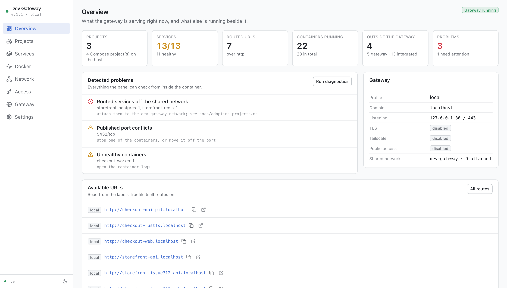
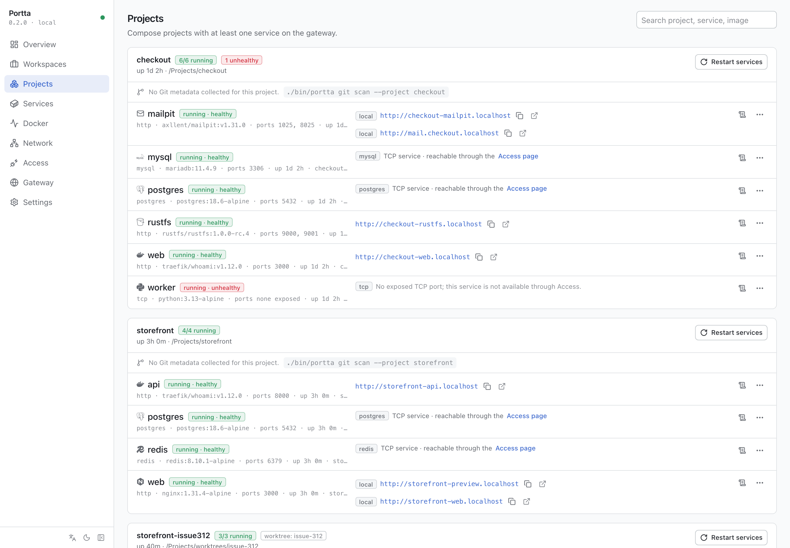
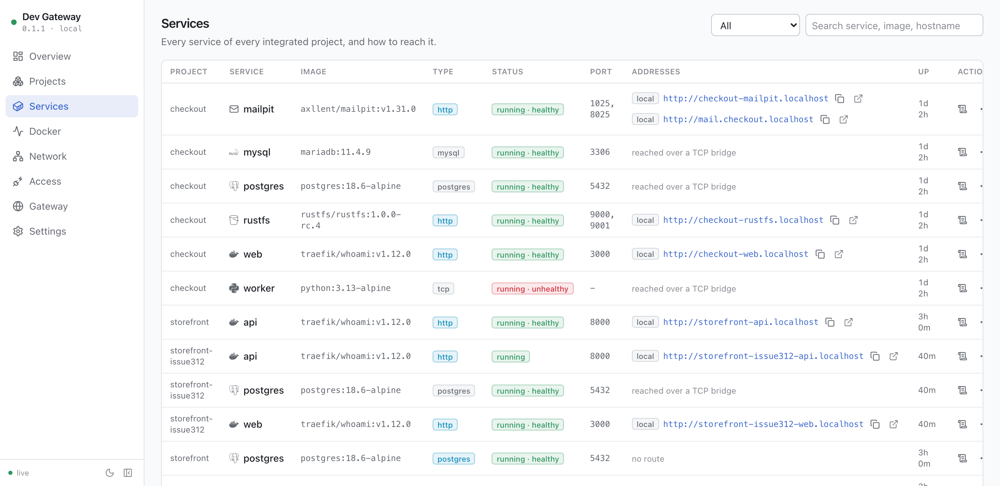
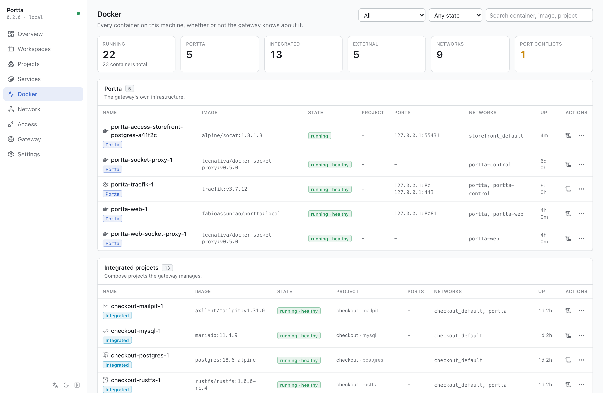
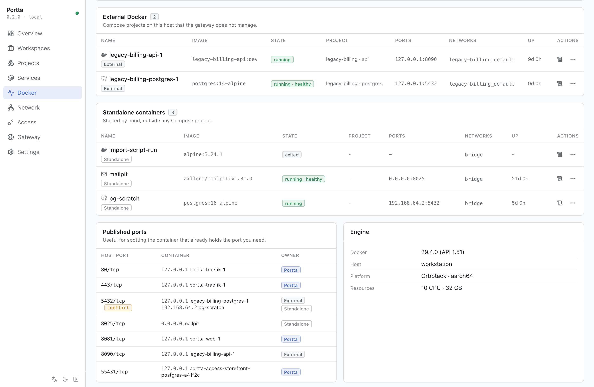
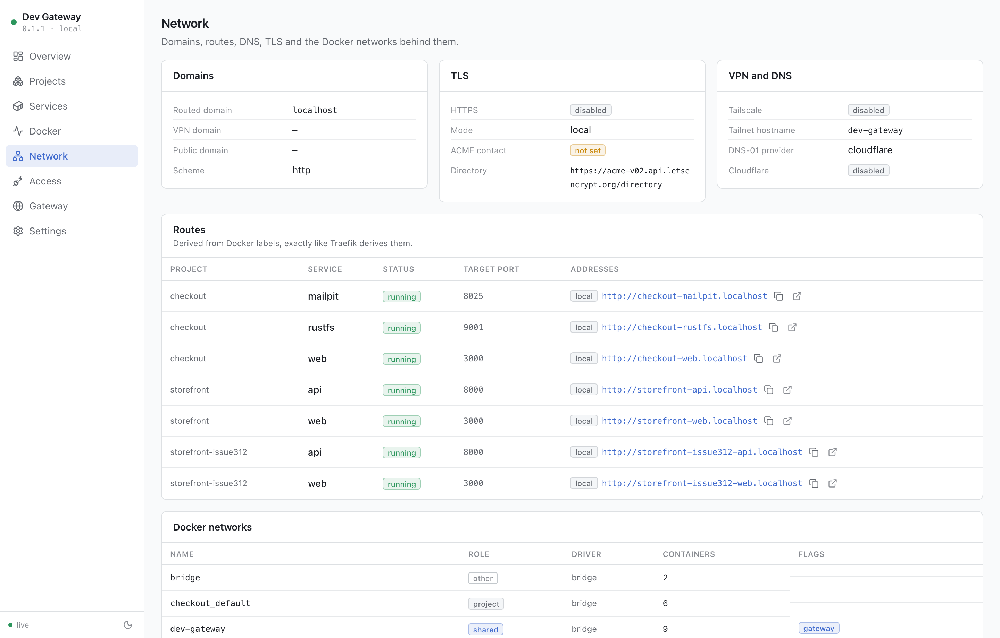
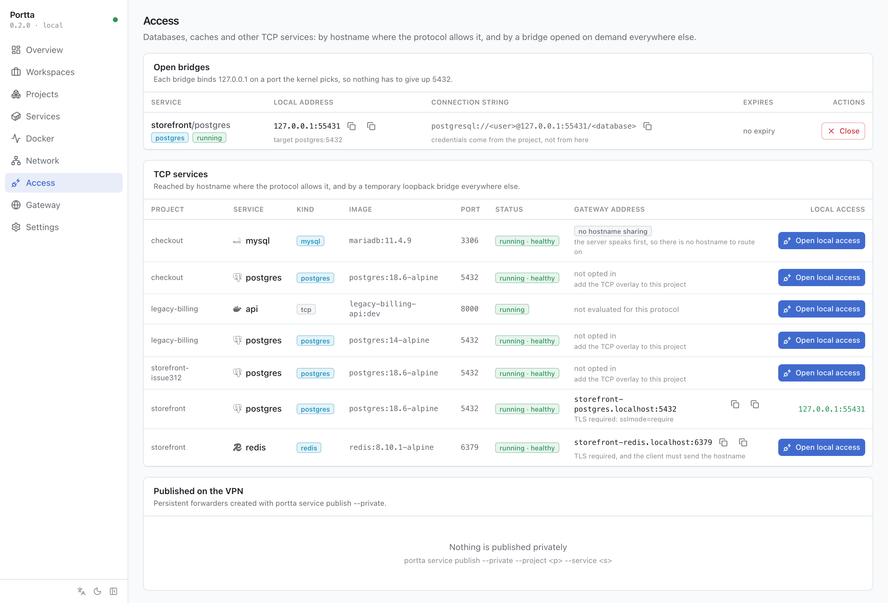
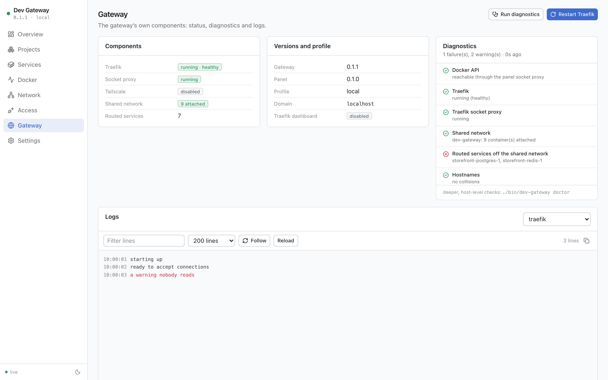
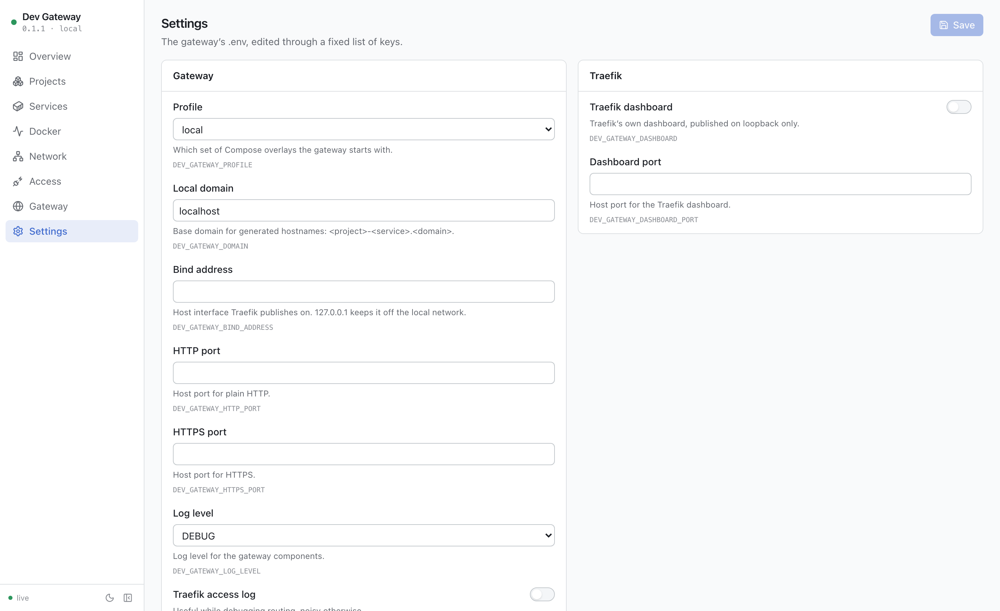

# The web panel

A small administration panel for the gateway: what is routed, what is running,
where to reach it, and what is in the way. It complements the CLI rather than
replacing it. Both read Docker and Traefik for live routing facts; the panel
additionally keeps gateway-owned preferences and metadata that the CLI does
not display. See [ADR 0013](adr/0013-what-the-panel-persists.md).

It is off by default.

```bash
./bin/portta web up
./bin/portta web open      # http://127.0.0.1:8081
```



Every screenshot on this page comes from the same host, described in
`apps/web/e2e/demo-host.mjs` and rendered by the real panel. Regenerate them with
`npm run screenshots` (see [Development](#development-with-hot-reloading)).

---

## What it is for

Switching between several environments in a day is mostly a lookup problem:
which URL does this project have today, which port is that other stack already
holding, is the container I forgot last week still running, and how do I point
a GUI client at this project's database without publishing 5432.

The panel answers those, and offers the few operations that go with them:
restart, stop, start, remove, read logs, open and close a TCP bridge.

It is not a Docker management tool. There is no image management, no volume
management, no `docker compose` editor, no terminal, no prune, and no way to
create an arbitrary container. See [Out of scope](#out-of-scope).

---

## Architecture

```text
Browser
   |                              http, loopback by default
Panel (Hono + React, one container)
   |-- filtered Docker API, internal control network
Panel socket proxy
   |                              read-only bind of the socket
Docker
Panel -- durable decisions --> PostgreSQL (private data network, no host port)
```

The panel application is a single container. In production the Node process serves both the
JSON API and the built UI, so there is one address to remember. It joins two
networks: the gateway's shared network (so it can be published, and routed by
Traefik when that is asked for) and its own `internal` control network, where
its socket proxy lives. A third, dedicated internal network connects only the
panel and its PostgreSQL database.

It never sees the Docker socket, has no Docker CLI, and reads exactly two
paths from the host: `.env`, which its Settings page edits, and `VERSION`.

Why a second socket proxy rather than Traefik's: Traefik's is read-only and
must stay that way, while the panel needs the container lifecycle. The two
permission sets are kept apart, and the panel enforces its own allowlist on top
of the proxy's. Its purpose-built client pins Docker Engine API `v1.43`, the
API implemented by the project's minimum supported Docker Engine 24, so a
newer daemon cannot silently change the response contract. See
[ADR 0008](adr/0008-web-panel-socket-proxy.md) and
[ADR 0017](adr/0017-no-docker-sdk.md).

### Technologies

| Layer | Choice |
|---|---|
| API | Node 24, TypeScript, [Hono](https://hono.dev/), Zod for input validation |
| UI | React 19, Vite 8, Tailwind CSS 4, Radix primitives, TanStack Query |
| Persistence | PostgreSQL 18, SQL migrations, typed repositories |
| Live updates | Server-sent events, fed by Docker's own event stream |
| Tests | Vitest (API, core, components), Playwright (end to end) |

### Shell and navigation

Each of the eight sections sets a contextual browser title ending in
`Portta`; a project route can refine it with the Compose project name.
Every new page must call `useDocumentTitle` so tabs, bookmarks and history do
not inherit the previous page's title. The built UI also serves its SVG favicon
locally, with no browser request to a third-party asset.

At `md` and above, the sidebar can collapse from its 208px labelled form to a
56px icon rail. The `portta-sidebar` preference survives reloads when local storage
is available and safely defaults to expanded when it is not. Icons keep native
tooltips and accessible labels, and the active section carries
`aria-current="page"`. Below `md`, navigation remains the labelled horizontal
strip and the collapse control is hidden.

PostgreSQL stores decisions and identity, not observations. Everything live on
screen (services, URLs, networks, ports, health and bridges) is still read from
Docker at request time, so a container that disappears simply stops appearing.
The database keeps the gateway instance, project identity, typed preferences
and integration configuration. If it is down, the panel and its Docker-backed
pages remain available and diagnostics report the degraded state. See
[Panel persistence](persistence.md).

---

## Starting it

```bash
./bin/portta web up          # build if needed, then start
./bin/portta web open        # print the URL, and open a browser
./bin/portta web status      # where it listens, and whether it is healthy
./bin/portta web logs        # follow it
./bin/portta web restart
./bin/portta web down        # stop it; the gateway keeps running
./bin/portta web disable     # stop it and take it out of `portta up`
./bin/portta db status       # database health, migration and size
```

`web up` writes `PORTTA_WEB=true` to `.env`, so from then on
`portta up` brings the panel along with the rest of the gateway.
`web disable` undoes that.

The panel image still builds its own Node runtime. Starting it through the full
CLI requires Node 22.12+ on the host; the core zero-Node fallbacks remain
`bootstrap`, `up`, `down`, `status` and `doctor`.

### Development, with hot reloading

```bash
make dev                     # gateway up, panel with hot reloading, routed URLs
./bin/portta web dev         # the panel alone, on a gateway already running
```

Two containers from the same image: the API with `node --watch`, and Vite in
front of it with HMR on `http://127.0.0.1:5173`. Only `apps/web/src` is
bind-mounted, so the image's `node_modules` stay in place. Edits under
`apps/web/src` reload on their own.

`./bin/portta web up` goes back to the built image.

If you do have Node on the host and prefer to work outside containers:

```bash
npm ci                 # from the repository root; installs every workspace
npm run dev --workspace=portta-web        # API on :8081
npm run dev:ui --workspace=portta-web     # Vite on :5173
npm test --workspace=portta-web
npm run test:e2e --workspace=portta-web
npm run openapi --workspace=portta-web    # refresh apps/web/openapi.json
```

### API contract

The panel publishes an OpenAPI 3.1 contract at
`http://127.0.0.1:8081/api/openapi.json`. It is generated from the same route
registrations and Zod schemas the server and UI use: parameters, request
bodies, response shapes, status codes, read-only refusals and the SSE payload
are all part of the document. It declares the host-scoped Portta session and
the HTTP Basic compatibility path for non-browser clients. Traefik asks the
separate auth process to enforce either one before a request reaches the panel.

`http://127.0.0.1:8081/docs/#/api` renders that document: operations grouped by
tag, resolved schemas for parameters, request bodies and responses, the
declared security schemes, and a console. `/api/docs` redirects there, so a
bookmark keeps working.

The console executes a `GET` on a click. A `POST`, `PUT`, `PATCH` or `DELETE`
says what it is about to send and waits for a second, explicit confirmation,
because it is a real request against this panel. Read-only mode and the
same-origin write guard come back as the API's own error payload rather than as
a generic failure, so a refusal reads as a refusal.

It is enabled by default only while the panel stays on loopback. A routed panel
returns 404 unless `PORTTA_RUNTIME_API_DOCS=true` explicitly opts in. The JSON
contract stays available because a caller that reached the API can already
inspect it.

`apps/web/openapi.json` is checked in so an API change is visible in review.
`npm run openapi:check` regenerates it in memory and fails on byte-level drift.
Adding or changing a route therefore requires updating its attached description
and running `npm run openapi`.

### The documentation, served from the panel

`http://127.0.0.1:8081/docs` is this documentation — every file under `docs/`
including the ADRs, plus the README and the changelog — rendered into the panel
image at build time, with a sidebar, an on-page table of contents, search, and
both themes. The book icon beside the language and theme controls opens it.

The source of truth does not move: `docs/*.md` stays ordinary Markdown, readable
on GitHub, with no front matter and no second copy. The navigation is the
section order of [`docs/README.md`](README.md), which the project already
maintains by hand.

Offline by construction. Everything comes from the image: no CDN, no font host,
no telemetry, and no Markdown parser in the panel's production tree — the
parsing happens at build time and only the rendered HTML ships. A link that
leaves the documentation set opens the file on GitHub and is marked with an
arrow. A Mermaid block is shown as labelled source rather than a broken picture:
rendering one needs a browser at build time, which is a dependency the image
does not take.

Because the build reads every link, it is also the link checker this repository
did not have: a link that names a documentation page which does not exist fails
`npm run build:docs`.

Two switches, independent on purpose:

| Key | Gates | Default |
|---|---|---|
| `PORTTA_RUNTIME_DOCS` | the guides at `/docs` | enabled, including when routed |
| `PORTTA_RUNTIME_API_DOCS` | `/docs/api` and its console | on for loopback, off when routed |

The guides are static text with no host information in them, so a routed panel
may serve them. The console issues real requests, so it keeps the conservative
default. Neither weakens authentication: when the panel is protected, the
ForwardAuth service runs before either path is reached
([ADR 0027](adr/0027-forward-authentication-service.md)).

### Regenerating the screenshots

The images on this page and in the README are produced by the real panel, run
against a fixed host described in `apps/web/e2e/demo-host.mjs`:

```bash
npm run screenshots --workspace=portta-web
```

They are generated rather than taken by hand so they stay in step with the UI,
show the same thing every time, and never contain whatever happened to be
running on the machine that produced them. Change the host in `demo-host.mjs`
and the framing in `e2e/screenshots.mjs`.

---

## Reaching it

### Local

`http://127.0.0.1:8081`, and nothing else. The port is published on
`PORTTA_WEB_BIND_ADDRESS`, which is `127.0.0.1` and should stay that way.

Change the port if 8081 is taken:

```bash
./bin/portta web up --port 8099
```

### Over the VPN

On a VPS, the panel is useful precisely when you are not sitting at the VPS.
The private profile routes it through Traefik, which on that profile listens on
the tailnet and nowhere else:

```bash
./bin/portta web auth set
./bin/portta web up --expose vpn
# https://portta-web.vpn.example.com
```

This adds a Traefik router for `PORTTA_WEB_HOST.<domain>` and the Portta
ForwardAuth middleware in front of it. It is refused on the `remote-public`
profile, where that private router would be public, and it is refused without
a credential: a routed panel can stop and remove every container on the host.

A routed panel also defaults to read-only. `--writable` opts out, deliberately.

### The credential

```bash
./bin/portta web auth set
#   user      dev
#   password  K7RXQ-M4WPD-J9TCF-B2NHY
# warn this is the only time the password is shown; only its hash is stored
```

The password is generated (twenty characters over a thirty-two symbol alphabet,
so about a hundred bits), shown exactly once, and stored as scrypt in the
owner-only `state/auth/protections.json`. Nothing puts it on a command line,
where `ps` would show it to every user on the host. Use `--password-stdin` to
supply your own, and `--user` to change the name.

Traefik hot-reloads the dynamic directory, so a running panel needs no restart.

```bash
./bin/portta web auth          # is it protected, and as whom
./bin/portta web auth apply    # re-render the middleware from .env
./bin/portta web auth clear    # refused while the panel is routed
```

None of this check lives in the panel. The separate `portta-auth` process serves
the login, validates the credential and issues a host-only session before the
request reaches any panel route handler. Logging out clears that session;
rotating the credential invalidates all sessions for this host. See
[Authentication](authentication.md) and
[ADR 0027](adr/0027-forward-authentication-service.md).

### Public exposure

```bash
./bin/portta web up --expose public
# https://portta-web.dev.example.com
```

Public exposure uses the same Portta login, lockout and host-scoped sessions.
It remains an explicit choice because this panel controls container lifecycle;
prefer a VPN when the audience does not need a public path, and use TLS whenever
the route crosses an untrusted network.

If you are on a plain VPS without a VPN, an SSH tunnel is the answer:

```bash
ssh -N -L 8081:127.0.0.1:8081 deploy@vps
# then open http://127.0.0.1:8081 locally
```

### Read-only mode

```bash
./bin/portta web up --read-only
```

Every mutating endpoint answers `403`. Useful when an agent is driving the
panel and you want it to be able to look but not touch.

---

## What you see

### Overview

Whether the gateway is up, how many projects and services are running, how many
are healthy, which URLs exist, whether Tailscale and public access are on, how
many containers are on the host, and how many of them the gateway knows
nothing about. Plus anything the panel detected as a problem.

Below the counters, a compact block shows this machine's capacity: OS, CPU,
memory, the filesystem that holds Docker and the one that holds Portta, and
an NVIDIA GPU when one is present. Static facts come from the Engine. Load,
memory in use and disk come from `portta host collect`, which writes
`state/host/host.json` the same way `git scan` writes `state/git`. With no
collection the block still renders, with a hint. There is no history.

The tiles are the questions people actually ask on a busy host, and the
problems card is the panel saying what it noticed rather than waiting to be
asked: see the [Overview screenshot above](#the-web-panel).

### Workspaces

The page for what you are working on, as opposed to what this host happens to
be running. A workspace has a name, a slug, a description, the repositories it
owns, and the environments that belong to it — and it stays visible with
nothing up, because it is a decision rather than an observation.

Each environment row says **why** it was adopted: linked by hand, declared by
its `portta.project` label, or matched through a repository the workspace
owns. Deleting a workspace removes the grouping and nothing else; the response
says as much.

Repositories come from the GitHub App projection, so only what the installation
granted can be attached — and the dialog says that rather than offering a list
that would be refused. With no App configured, a workspace still groups
environments; it simply has no repositories.

A workspace page also lists the **issues** of the repositories it owns, read
from the panel's projection: filter by state, status or text, sub-issues nested
under their parent, the repository badged on every row, and each number linking
to GitHub. A status that came from the label convention rather than a native
field is marked, because it changes what a write will do. Every row says how old
its answer is, and the list keeps answering while GitHub is unreachable.

Workspaces need the panel's database. With PostgreSQL stopped the page explains
that instead of failing, and every Docker-backed page keeps working.

See [github.md](github.md#workspaces-repositories-and-the-environments-that-belong-to-them).

### The board and the backlog

`#/board/<workspace>/board` puts the workspace's open issues in six columns —
Backlog, Ready, In Progress, Review, Blocked, Done — with the repository badged
on every card, so a multi-repository product reads as one board.

The columns are **data, not code**: a `boardColumns` setting with a schema and a
default. Configuring them is not in scope; being able to is, and that cost one
key rather than a later refactor.

**Moving a card.** Drag it, or use the card's actions menu — the same mutation,
reachable from the keyboard, and the honest path on a touch screen where
dragging is awkward. Either way the card moves immediately, the write goes to
GitHub, and a refusal rolls it back **visibly** with the reason on screen. A
move announces its result in a live region.

A status that came from the `status:` label convention rather than a native
field carries a discreet marker, because changing it adds one label and removes
another and that shows in the issue's timeline.

**The backlog** is a list rather than a board: work with no status yet, with
sub-issues nested under their parent, each row opening the same edit dialog. A
persisted manual order is deliberately not offered — it would be Portta
state GitHub cannot see.

**Filters** — repository, priority, assignee, label and free text — live in the
hash, so a filtered board is a link somebody can paste.

**Creating and editing** writes to GitHub and shows what GitHub confirmed. The
panel never displays an issue GitHub did not acknowledge, so there is no
optimistic row here — only on the move, where the rollback is visible.

Read-only mode disables the affordances rather than failing on use; an
unavailable database and an unreachable GitHub each say so and leave the
projection readable.

### Projects

Compose projects with **at least one** service on the gateway, grouped by
`COMPOSE_PROJECT_NAME`:

```text
base-empresarial
├── web        routed   http://base-empresarial-web.localhost
├── api        routed   http://base-empresarial-api.localhost
├── postgres   tcp      5432
└── redis      tcp      6379
```

A project's database belongs to the project even though it never joins the
shared network. The worktree is shown when the Compose working directory
disagrees with the project name, which is what
[`portta namespace`](monorepos.md) produces.

Each service row owns its endpoints, so several local, VPN or public addresses
remain grouped with the container that serves them. The row also keeps image,
kind, ports, uptime, state, logs, details and lifecycle actions. A database or
cache points to the Access page instead of leaving an empty URL cell; a stopped
service hides stale endpoints, and an HTTP service with routing enabled but no
discovered URL is called out as a routing problem. The rows wrap rather than
turning the project card into a horizontally scrolling table.

The project page and each card have Start, Stop and Restart for the whole
project. Stop asks for confirmation and lists the services; nothing is
removed. Start iterates containers that still exist. If they are gone, Start
is disabled and the reason names the runner.

The project page also has Rebuild and two named removals: **Remove, keep
data** and **Remove and local data**. Rebuild asks the runner for
`compose up --build` and shows the log; rebuild without cache is a
secondary option with its cost stated. Both removals require the Compose
project name typed back, checked on the server. The dialog says in its own
sentence that GitHub is not touched. Without the runner the panel removes
the containers it can and prints the exact `compose down` / `rm -rf` that
finish the rest. Directory removal is opt-in on the data-removing mode, and
only when the runner is present.



#### One project, one page

Clicking a project name opens `#/projects/<name>`, a page of its own rather
than the list filtered down to one card. It is organised in tabs, and each tab
is a URL:

```text
#/projects/storefront            Overview
#/projects/storefront/services   Services
#/projects/storefront/git        Git
#/projects/storefront/logs       Logs
```

When the panel can tell which issue an environment is running for, Overview
opens with a compact issue block — repository, number, title, type, priority,
status — and says **why** it was linked: the `portta.issue` label, the
branch, the namespace, or by hand. See
[github.md](github.md#the-issue-and-the-environment-it-is-worked-in).

**Overview** answers "what is this and where does it live": services running,
unhealthy count, routed URLs and uptime as tiles; the host directory, worktree,
logical project, Git root, repository and networks as rows; every endpoint
grouped by service; and a one-line Git summary linking to the Git tab.

**Services** gives each service the room the list cannot: endpoints, container
and published ports, networks, mounts, restart count, exit code, what Traefik
says about it, and its Exposure controls. The full container dialog is still one
click away.

**Git** shows the whole of what the host collected — branch, HEAD, the working
tree spelled out, ahead/behind against the upstream, the remote, and **every**
open pull request rather than the first few the card had room for.

**Logs** reads the project's services together; see
[Logs across a project](#logs-across-a-project).

Tabs are links, so the browser's back button moves between them, a tab survives
a reload, and a filtered view is something you can paste to someone. They are
operable from the keyboard with the arrow keys, `Home` and `End`. A project that
stopped between the list and the page renders an empty state with a route back
to the list, never an error.

#### What the environment is running

Each project carries a line of Git: the branch, HEAD with its subject, how much
is uncommitted, and how far it has drifted from the remote. The branch, the
commit and the repository are links when the remote is one whose shape is
known.

```text
Git   feature/59-invoices · 9f2c1ab "Add invoice totals"
      7 uncommitted changes · 3 ahead        owner/repo · collected 4 min ago
```

**None of it is live, and the line always says how old it is.** The panel
cannot read a working tree: it has no project directory mounted, no `git`, and
no way to run a command. What it reads is a file the host wrote:

```bash
./bin/portta git scan          # every running project
./bin/portta git scan --project storefront-issue59
./bin/portta git status        # what was collected, and when
```

`portta up` and `portta web up` run a scan for you. For anything more
frequent, a cron entry is the honest answer; the panel never polls, and a scan
that is too old to trust is marked rather than quietly shown as current.

Four absences all render as fewer things rather than an error: a project
without Git gets no line, a repository without a remote keeps its branch and
loses the links, a remote on a forge nobody recognises keeps the repository
link and loses the commit one, and a project nobody has scanned shows the
command that would fix that.

Nothing beyond metadata is collected: no diffs, no file contents, no commit
list beyond HEAD. Nothing is ever written to a repository, and there is no
checkout, merge or rebase anywhere in the panel or the CLI. See
[ADR 0010](adr/0010-git-collected-on-the-host.md).

#### Open pull requests

```bash
./bin/portta git scan --with-prs
```

adds the open pull requests, with their review decision and whether checks are
passing, through `gh`:

```text
2 open pull requests   #61 Add invoice totals  review requested  checks passing
                       #62 WIP  draft  checks failing
```

It reuses the authentication `gh` already has, so **there is no token to put in
`.env`**, nothing for a routed panel to leak, and no rate limit of ours to
account for. It is opt-in because it is a network call per project, and the
result is cached for `--forge-ttl` seconds (five minutes by default) so a scan
across ten projects does not make ten requests a minute apart.

Three cases render nothing at all rather than an error: `gh` is not installed,
`gh` is installed but signed out, or the remote is on a forge `gh` cannot talk
to. In the last case the Git line keeps its repository link, since that is
derived from the remote and needs nobody's permission.

#### Logs across a project

The Logs tab reads **every** service of the project at once, interleaved by the
timestamp Docker already puts on each line, with the service name in front:

```text
web      | 10:00:01  listening on 3000
api      | 10:00:02  GET /health 200
postgres | 10:00:03  ready to accept connections
```

A selector narrows the view to one service, and the choice is in the URL
(`#/projects/alpha/logs?service=api`), so a link opens on exactly what you were
reading. Tail size, the text filter, follow, timestamps and copy are the same
controls the container dialog has, because it is the same component; copying an
aggregated view prefixes each line with its service.

Services are read concurrently on the server, and a source that could not be
read is reported **beside** the ones that answered rather than replacing them: a
stopped container is marked with its state, an unreadable one carries the
reason, and four working services stay on screen. An unknown project is a 404; a
known project whose sources all failed is a 200 that says why.

The aggregated default is 100 lines per service (200 when reading one), clamped
to 2000 overall, so a ten-service project cannot ask for twenty thousand lines.
If a container logs through a driver that omits timestamps, the view says
ordering between services is approximate rather than pretending otherwise.

**Out of scope, deliberately:** streaming over SSE or WebSocket, retention,
indexing, structured-log parsing, level filtering and download-as-file. This is
a bounded tail on a three-second poll, and it is meant to stay one.

#### Naming a project without touching it

A cloned third-party repository arrives as `awesome-thing-svc-1` on
`awesome-thing-svc-1.localhost`, with five services listed flat. **Settings** on
the project page adjusts all of that from the panel, and writes nothing inside
the project — no file, no label, no dependency, no commit. `git status` in the
clone stays clean after using every control here.

| Override | Effect |
|---|---|
| Display name | The heading and the sort key. The derived name is still shown beside it |
| Description | A line under the heading |
| Primary service | The service the project's Open button targets |
| Collapsed services | Folded away by default, never removed |
| Pinned / archived | Ordering and default filtering in the list |
| Service note | A line on the service row |
| **Hostname alias** | **An additional hostname, routed by Traefik** |

Everything except the alias is presentation, kept in the gateway's own
database. **Nothing is ever only-renamed**: the derived name and the derived
hostname stay on screen next to the override, so a hostname that behaves oddly
can still be traced back to the label that produced it.

Overrides key on `COMPOSE_PROJECT_NAME`, so `storefront` and
`storefront-issue59` are two environments with two sets of overrides, and a new
worktree starts blank. That is deliberate: two worktrees must never contend for
one hostname.

With PostgreSQL stopped, every project renders exactly as it does without any
persistence at all, and the override endpoints answer `503` with a hint. The
feature disappears; nothing else notices.

#### A hostname alias is a nickname, not a rename

```text
alpha-web.localhost      derived, still answering
shop.localhost           alias, answering too
```

Setting an alias writes one router into `portta-aliases.yaml`, the third
and last file the panel may write in Traefik's dynamic directory
([ADR 0011](adr/0011-panel-reads-traefik-writes-one-file.md)). Traefik
hot-reloads it: no container is recreated and the gateway is not restarted.

**Both hostnames answer.** The panel cannot rewrite a label on a running
container, and would not restart someone's environment to change a nickname, so
an alias can only ever be additional. The UI shows both, everywhere.

Aliasing **refuses** rather than warns, and every refusal happens before
anything is written:

- a hostname a running container already derives or declares;
- a hostname another alias already took;
- a hostname outside `PORTTA_DOMAIN`, `PRIVATE_DOMAIN` or `PUBLIC_DOMAIN`
  — the gateway will not mint an address it cannot serve;
- a service whose `kind` is not `http`: a database is reached through
  [tcp-routing.md](tcp-routing.md), not by an HTTP router;
- a service off the shared network, or one that never enabled Traefik;
- a service with no unambiguous HTTP port. The project's own
  `traefik.http.services.*.loadbalancer.server.port` label is used when present
  and a single exposed port otherwise; anything else is refused rather than
  guessed, because a guessed port produces a router that silently 502s.

The database row and the generated file are written as one operation, and a
failed file write rolls the row back, so the panel and Traefik cannot disagree
about what answers.

The CLI reads the same file, so the two tools never contradict each other:

```bash
portta urls          # aliases are listed and marked as such
portta doctor        # flags an alias whose target container is gone
```

Anything the panel refuses can still be written by hand into
`config/traefik/dynamic/` — that file is yours, and the panel never touches it.

#### Sharing it, temporarily

The Exposure section on a service offers three states: **private** (the absence
of a share, and the default), **protected** (an additional hostname behind a
generated password) and **public** (an additional hostname with none, refused
unless public access is already on).

Every share carries an expiry, the password is shown exactly once and stored
only as a hash, and revoking one deletes a block from a generated file. The
project's own router, labels and configuration are never touched.
`portta share list|revoke|gc` manages the same objects from the host. See
[sharing.md](sharing.md).

#### Why a route behaves like this

Opening a service shows what Traefik itself says about it, next to what its
labels say: the router it built, the rule, the entrypoints, the middlewares, the
backend it resolved, and its status with Traefik's own error text when it
refused one.

```text
Traefik   storefront-web@docker   enabled   websecure     dashboard →
          Host(`storefront-web.dev.example.com`)
          middlewares: portta-secure-headers@file
          → http://172.18.0.7:3000
```

This is the one question labels cannot answer. The panel derives hostnames the
same way Traefik does and is right about them, which is exactly why "the labels
look right and it still 404s" had nowhere to go.

It needs the Traefik API, which means `PORTTA_DASHBOARD=true`, and that is
off by default. When it is off the panel says **the API was not asked** rather
than implying the labels were confirmed, and everything else is unchanged.
`doctor` gains two checks when it is on: a routed service Traefik never built a
router for, and a router Traefik refused, quoted.

The read has its own timeout and its own cache and never runs while a page is
rendering, so a slow or dead Traefik costs nothing but this block. The dashboard
is linked to, never embedded: it is a good tool and duplicating it would need
the insecure-mode API exposed more widely than it already is. See
[ADR 0011](adr/0011-panel-reads-traefik-writes-one-file.md), and
[security.md](security.md) for what enabling that API costs.

### Services

Every service of every integrated project as a flat, filterable list: image,
type, status, health, container port, and the addresses it answers on, split
into **Local**, **VPN** and **Public**. Every address has a copy button.

Addresses come from the same Docker labels Traefik routes on, so what the panel
prints is what Traefik serves. An explicit ``Host(`...`)`` label wins over the
derived hostname, exactly as it does inside Traefik.



### Docker

Every container on the host, in four clearly separated sections:

| Section | What it means |
|---|---|
| **Portta** | The gateway's own infrastructure. Managed by the CLI, not from here |
| **Integrated projects** | Compose projects connected to the gateway |
| **External Docker** | Compose projects the gateway does not manage |
| **Standalone containers** | Started by hand, outside any Compose project |

They are never mixed into one list. An external container is shown for
diagnosis, not because the gateway has any opinion about it: no URLs, no DNS,
no bridges, no gateway actions. Just what it is, what it holds, and the few
operations below.



Below the sections, a host summary: engine and resources, container counts by
section, networks, and every published port with the container holding it.
Ports claimed by two containers are flagged, which is usually the answer to
"why will this not start".



Filters: All / Portta / Integrated / External / Standalone, crossed with
Any state / Running / Stopped / Unhealthy, plus a search over container name,
image, project, service and hostname.

### Network

Domains (local, VPN, public), TLS mode and ACME contact, Tailscale state, the
DNS provider, every routed hostname with its target port, and the Docker
networks with their role: shared, control, access, or a project's own.



### Access

Databases, caches and anything else that speaks TCP rather than HTTP.

```text
PostgreSQL    base-empresarial/postgres     [ Open local access ]
```

and afterwards:

```text
127.0.0.1:55431      copy host   copy port   copy connection string   close
```

The bridge is the same one [`portta access open`](tcp-access.md) creates,
with byte-identical labels, so `portta access list`, `close` and `gc`
manage it too and neither tool is surprised by the other's work. It binds
`127.0.0.1` on a port the kernel picks, so any number of databases can be
reachable at once without one of them having to give up 5432.

The connection string is a template. It never contains a password: the gateway
does not read a project's `.env` to be helpful.

The **Gateway address** column is the other way in, when
[hostname routing](tcp-routing.md) is enabled: a stable
`<project>-<service>.<domain>:<port>` that needs no bridge at all. Where a
protocol cannot do it the column says so rather than leaving a blank, and where
a project has not opted in it says that too.



This page also lists persistent forwarders created with
[`portta service publish --private`](tailscale-services.md).

### Gateway

Component states, versions, the profile, diagnostics, and logs for Traefik, the
socket proxy and Tailscale.

**Diagnostics are not `portta doctor`.** They are the checks a container
can make honestly: components present and healthy, the shared network, services
that opted into Traefik but never joined it, hostname collisions, port
conflicts, stale bridges, unhealthy containers, and configuration that would
refuse to start. `doctor` runs on the host and additionally sees `PATH`,
listening sockets, DNS resolution and certificate files, which this process
cannot see truthfully. The panel says so and points at the command.



### Settings

The settings people actually change, from a fixed catalogue: domains, ports,
bind address, profile, TLS and ACME, Tailscale, public access, DNS provider,
and the panel's own options. Each server-defined group has a stable deep link,
such as `#/settings/tls` or `#/settings/public-access`. Moving between groups
keeps one shared draft; badges identify unsaved work in another group and Save
writes every changed key in one transaction. A key that is not in the
catalogue cannot be read or written through the API, whatever a request asks
for.

The Traefik group shows the dashboard's status, every address that applies,
and an Open action that is enabled only when an endpoint is usable. Changing
`PORTTA_DASHBOARD` needs the gateway recreated; the apply bar at the bottom
is how that happens. `PORTTA_DASHBOARD_EXPOSE=domain` puts the dashboard on
the derived hostname behind the same login as the panel.



### Light and dark

The panel follows the system theme and remembers an explicit choice. The same
Overview, in the dark theme:


---

## Actions

| Target | Available |
|---|---|
| Integrated service | logs, start, stop, restart, details, remove (with confirmation) |
| External container | logs, start, stop, restart, details, remove (with confirmation) |
| Project | restart its running services, open its URLs, see its services |
| TCP service | open a loopback bridge, close it, copy host / port / connection string |
| Gateway | status, diagnostics, logs, restart components, apply saved settings (opt-in) |

Never offered: recreating **somebody else's** Compose project, editing
configuration or environment variables of a container, changing its networks or
volumes, running an arbitrary command, `docker compose down -v`, resetting a
database, mass removal, or any kind of prune.

The one exception is the gateway's own project, and only through the opt-in
applier described below ([ADR 0026](adr/0026-applying-settings-from-the-panel.md)):
a container the host prepares, whose command is fixed at creation and which the
panel can only start.

### Removing a container

The only destructive action, and it always asks first. The confirmation names
the container and its image, says whether it belongs to the gateway or is
external, and lists its named volumes and bind mounts.

What a removal does **not** do:

- it does not remove a volume, named or anonymous (the call is always
  `v=0&link=0`);
- it does not remove a network;
- it does not remove an image;
- it does not touch a sibling in the same Compose project;
- it never runs a prune.

Gateway components cannot be removed from the panel at all. Access bridges are
closed from the Access page, which removes them cleanly.

### Restarting the gateway

`Restart Traefik` restarts the container in place. Traefik reads its static
configuration from the environment it was created with
([ADR 0003](adr/0003-traefik-static-config-via-env.md)), so a settings change
needs the containers **recreated**, not restarted. The panel says this rather
than pretending a restart was enough: saved settings the running gateway has not
picked up are marked `pending restart`, and a bar at the top of every page says
so wherever you are.

By default, applying them is a command on the host:

```bash
./bin/portta up local
```

### Applying settings from the panel

With `PORTTA_APPLY=true` in `.env`, `portta up` also prepares a stopped
container whose command is fixed at creation — `portta up`, with no argument the
panel can influence — and the pending bar gains an **Apply and restart** button
that starts it.

The confirmation names the pending keys, and says plainly that this panel is one
of the containers being recreated. It then shows a dialog with a stopwatch while
the panel goes offline and comes back, and reports the applier's exit code and
output if it failed. If a pending setting moves the panel's own address, the
confirmation says the tab will not reconnect on its own.

On a repository checkout the apply rebuilds the local images first, which takes
minutes rather than seconds on a cold cache. The confirmation says so, and the
panel waits longer before declaring a timeout. If there is no applier at all,
the bar names which of the three reasons applies — the key is off, this host
refuses, or `portta up` has not prepared one yet — rather than guessing.

Turning this on is a host decision, deliberately: the key is not in the panel's
field catalogue, so the panel cannot enable itself. Be clear about what it
grants — anyone who can write through the panel can then run `portta up` on the
host. It is refused in read-only mode, refused when the panel is exposed
publicly, and refused on the `remote-public` profile. See
[ADR 0026](adr/0026-applying-settings-from-the-panel.md) for the full account,
including what can still go wrong.

---

## Configuration

All of these live in `.env`; `portta web up` sets the first ones for you.

| Key | Default | Meaning |
|---|---|---|
| `PORTTA_WEB` | `false` | Whether the panel starts with the gateway |
| `PORTTA_WEB_BIND_ADDRESS` | `127.0.0.1` | Interface the panel is published on |
| `PORTTA_WEB_PORT` | `8081` | Host port |
| `PORTTA_WEB_EXPOSE` | `local` | `local`, or `vpn` to add a Traefik router |
| `PORTTA_WEB_HOST` | `portta-web` | Hostname label used by `--expose vpn` |
| `PORTTA_WEB_READ_ONLY` | `false` | Refuse every mutating endpoint |
| `PORTTA_WEB_DEV` | `false` | Development mode, with Vite in front |
| `PORTTA_WEB_DEV_PORT` | `5173` | Vite's port in development mode |
| `PORTTA_WEB_NETWORK` | `portta-web` | The panel's internal control network |
| `PORTTA_WEB_USER` | `node` | User the container runs as, see below |

`.env` is owner-only, so the container has to run as whoever owns it. The
installer records this, and `bootstrap` and `web up` now record it too when the
key is absent:

```bash
PORTTA_WEB_USER=1000:1000     # $(id -u):$(id -g)
```

The image's own `node` is a last resort, and is right only when the host uid
happens to be 1000 — on macOS it is usually 501, so the default was wrong there
as well, not only on Linux. The panel reports whether the file is writable and
says to edit it on the host when it is not.

Vite, in development mode, deliberately keeps running as `node`: it writes no
host file and does write inside the image, where only `node` has permission.

---

## Security

The panel is the one component that can start, stop and remove containers, so
what it cannot do matters more than what it can.

**Network.** Loopback by default. VPN routing, the dedicated public panel
entrypoint and routing on the gateway's own domain are separate, explicit
overlays and all three are refused without a credential. Public panel exposure
does not publish the application's `web`/`websecure` entrypoints.

`PORTTA_WEB_EXPOSE=domain` routes the panel at one hostname of the gateway's
domain, on `websecure`, so it gets the certificate that entrypoint already
terminates instead of the plain HTTP the `panel` entrypoint serves. It requires
TLS and a credential, publishes no host port, and names exactly one host — an
application is still reachable only through a router of its own. What it gives
up, and why, is written down in
[ADR 0021](adr/0021-panel-access-modes.md#amendment-2026-09-02-domain-and-what-it-costs).

**Authentication.** Traefik calls the separate `portta-auth` process before
forwarding a protected request. The password is generated, shown once and
stored only as scrypt in `state/auth/protections.json`; the auth process mounts
that file read-only and has no Docker socket or database. A middleware Traefik
cannot resolve makes the router fail closed. `doctor` and the panel's own
diagnostics fail, not warn, when the secret, store or auth service is missing or
unsafe. See [Authentication](authentication.md).

**Traefik configuration.** The panel mounts `config/traefik/dynamic/`
read-write and may write exactly four filenames in it,
`portta-panel.yaml`, `portta-shares.yaml`, `portta-aliases.yaml` and
`portta-auth.yaml`. Any other path is refused in its own process,
before the write. Everything else in that directory
is yours. See [ADR 0011](adr/0011-panel-reads-traefik-writes-one-file.md).

**Docker.** Its socket proxy grants the read endpoints plus the container
lifecycle, and denies images, volumes, exec, build, swarm, secrets, plugins and
the system endpoints. On top of that the panel refuses to emit any request that
is not on its own allowlist, so `prune`, `exec`, `archive` and `attach` are
denied even where the proxy would forward them. See
[ADR 0008](adr/0008-web-panel-socket-proxy.md).

**Container creation.** One shape only: the socat TCP bridge, with a fixed
image, fixed labels, no binds, no mounts, no capabilities and no privileged
mode. There is no generic create endpoint.

**Secrets.** `TS_AUTHKEY` and `CF_DNS_API_TOKEN` are never returned by the API,
in whole or in part. The panel reports only whether they are set. Sending an
empty string leaves a secret unchanged; clearing one is explicit. `.env` is
written through a temporary file with mode `600`.

**Writes from another site.** A page on another origin can point a request at
`127.0.0.1`. Reads behind loopback are harmless enough; writes are not, so a
mutating request must come from the panel's own origin (or `localhost`).

**Input.** Every request body is validated with a schema before anything acts
on it. Container ids are checked against Docker's own shape. No shell command
is ever built from a value the UI supplied, because the panel runs no shell
commands at all.

`tests/unit/web.test.sh` asserts each of these as an invariant, so loosening one
fails the build. The wider threat model is in [security.md](security.md).

---

## Troubleshooting

**The panel does not come up.**

```bash
./bin/portta web status
./bin/portta web logs
```

**"cannot reach the Docker socket proxy".** The panel's proxy is not running or
not healthy:

```bash
./bin/portta web logs web-socket-proxy
./bin/portta web restart
```

**Everything is empty, and the Overview says the Docker API is unreachable.**
The proxy is up but denying calls. Confirm the panel is talking to its own
proxy (`PORTTA_RUNTIME_DOCKER_API`), not Traefik's read-only one, which denies every
write.

**"Open local access" says the bridge image is not on this host.** The panel
cannot pull images, deliberately. Pull it once on the host:

```bash
docker pull alpine/socat:1.8.1.3
```

`portta web up` does this for you; this happens when the panel was started
some other way.

**Settings will not save.** The panel reports the file as not writable. On
Linux, set `PORTTA_WEB_USER` as above, or edit `.env` on the host.

**A saved setting has no effect.** Traefik reads its static configuration at
startup. Run `./bin/portta up <profile>` on the host; the panel shows the
exact command.

**The live indicator says `offline`.** The event stream dropped. The panel
reconnects on its own, with backoff; a reload also does it. Everything else
keeps working, it just stops updating by itself.

**Port 8081 is taken.** `./bin/portta web up --port 8099`. The Docker page
shows which container is holding it.

**A container I removed came back.** It belonged to a Compose project, and
something ran `docker compose up` in that project's directory. The panel warns
about this in the confirmation.

---

## Out of scope

Not implemented, and not planned for this version: users, roles and RBAC (the
panel has one credential, held by Traefik), historical metrics, monitoring,
Kubernetes, deployments, a Compose editor, a web terminal, image management,
volume management, network management, arbitrary container creation, arbitrary
Traefik configuration, an embedded Traefik dashboard, a tunnel service, or
being a replacement for Portainer or Docker Desktop.

GitHub issues, a board and write-back **shipped**: the Board and Workspaces
pages, `GET /api/issues`, `PATCH /api/issues/:id` and
`POST /api/repositories/:owner/:repo/issues`. This paragraph said they were not
in the panel yet, which #25 found to be the opposite of what the code does.
[github.md](github.md) describes what exists;
[ADR 0018](adr/0018-github-access-lives-in-the-panel.md) records the decisions
and, in its 2026-09-02 amendment, what is deliberately still absent.

The same issues are also reachable as **tasks** — `next`, `start`, `status`,
`finish`, `comment` — which is what `portta mcp` serves to an agent over stdio.
See [mcp.md](mcp.md).

What remains out of scope there: comments are never projected (reading one is a
link to GitHub), and GitHub Projects v2 fields are not read — a repository whose
board lives in a Project is invisible to Portta, and Portta's `status:*` labels
will not move its cards. Local Git stays host-collected
([ADR 0010](adr/0010-git-collected-on-the-host.md)).

Sharing is deliberately narrow: one additional hostname per service, with an
expiry, on a network the gateway already answers. It is not authentication for
a project and never becomes an identity layer.

The panel exists to make the gateway pleasant to use day to day, for people and
for agents, and to stop there.
